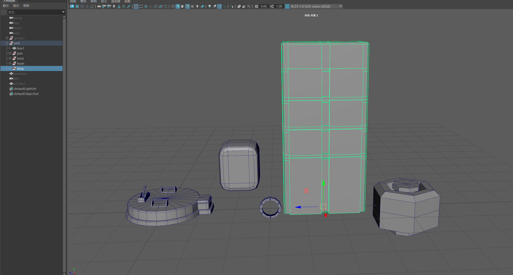
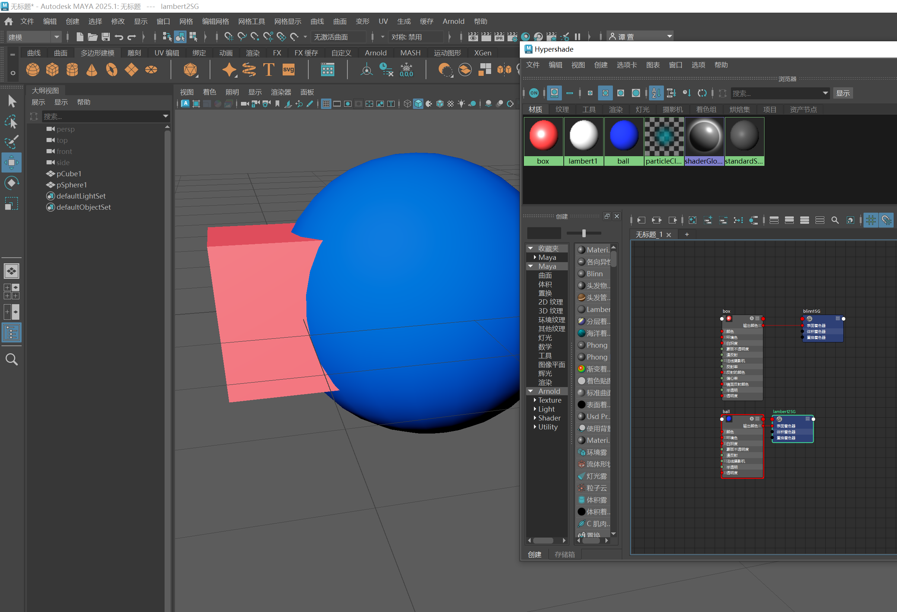
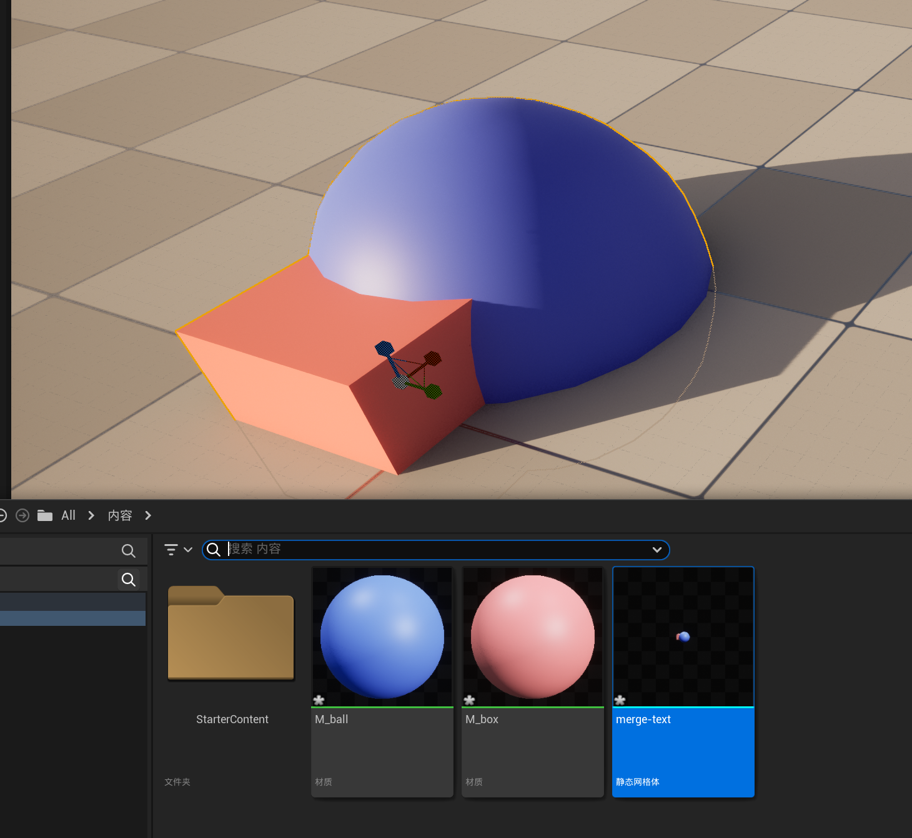
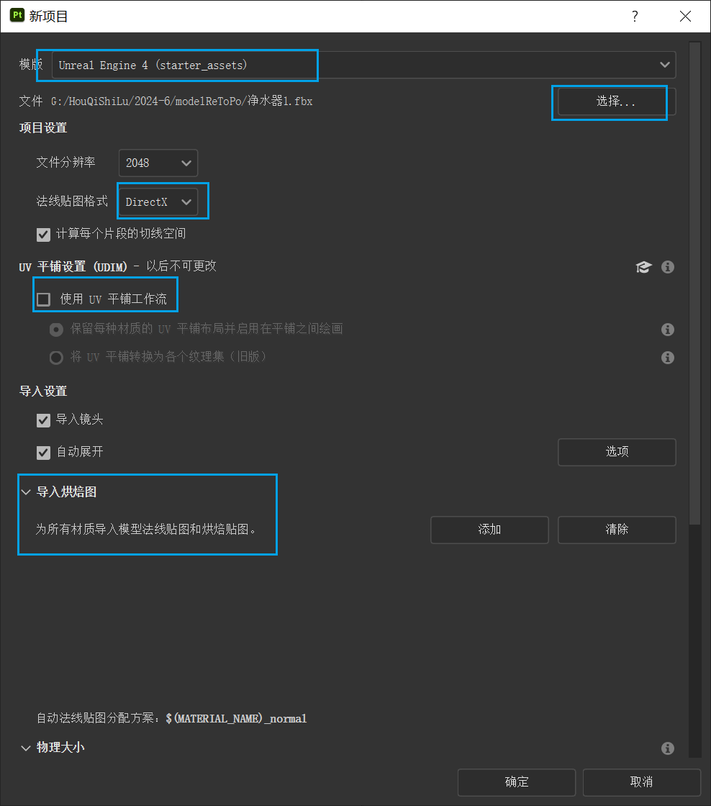
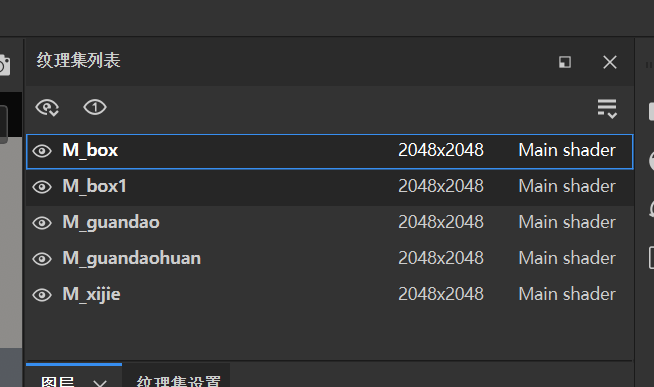
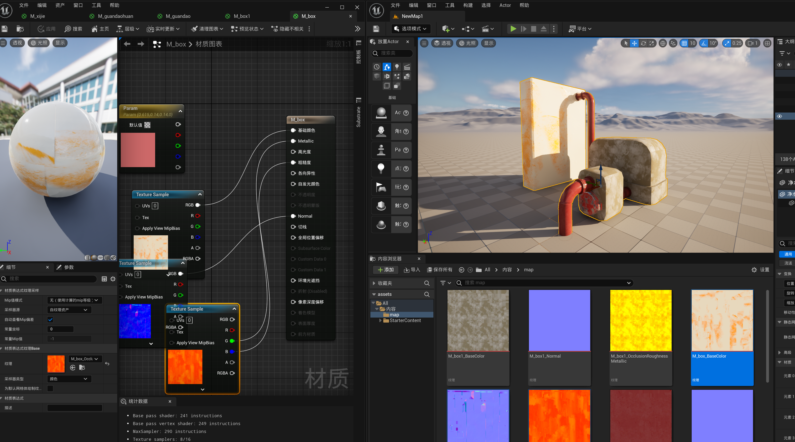
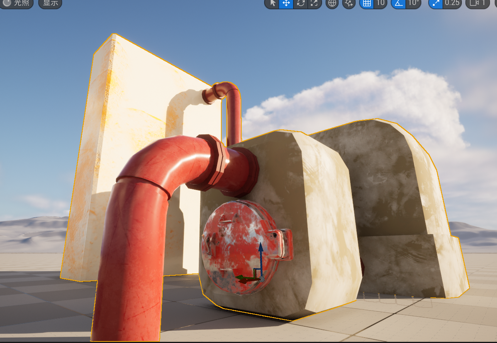
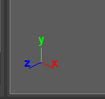
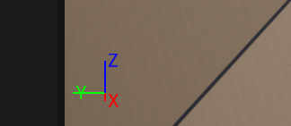
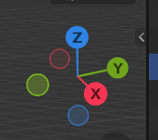

## 建模

- 资产化单元化【要求原画要足够详细设计足够完善才开始建模，建模软件里返工的时间花费远高于画一个详细的原画！】
- 勤用组，最终完成的物体坐标轴要放在方便它摆放的位置
- 勤切对称轴线，方便其他物体摆放时吸附。但最终可以删掉。善于运用栅格粗估计距离。
- 建好每个单元，养成习惯要给好材质拆好UV，【拆好UV给好材质才算建完】
- 不允许出现五边面。允许三边面，建议四边面
- 硬边尽量倒角卡边
- 看不到的面不要保留。
- 其他细则：见后文


## 烘焙法线
你当然可以不烘焙法线。不一定每个模型都需要很高的质量。
[点这里](./法线烘焙.md)
## 材质球
**不使用多象限UV**
完成上述流程，应该有许多完成的基本单元体。现在将他们摆放到合适的位置。
>最终导出的模型不应该带有任何组信息，就是合并为一个模型。合并模型UV会重叠，所以需要给不同的材质球。**一套UV必须对应一套材质球**，但是一个材质球可能不对应UV(你可以不展UV的)
>
>
> 如上图。合并之后，UV会叠置在第一象限，贴图依赖材质球找到UV，再贴到模型上。

注：下图命名不规范



## 导出规范
1. 模型命名：
```shell 
SM_[模型英文名/英文拼音名]
```
Static Mesh（静态网格体）首字母
2. 材质球命名：
```shell
M_[材质英文名/英文拼音名]
```
Material（材质）首字母
3. 模型坐标轴必须在物体底部正中心（或者说，你想怎么摆，坐标轴就放哪）；模型大小需要依照统一的比例尺缩放。最终所有导出的物体的坐标值都要回归默认值。不允许在游戏引擎里矫正坐标变换。x轴朝前。(见附录一)

## 材质

不讲SP操作，只讲项目设置


可以看见SP里的材质球和UV的对应关系。

## Unreal Engine
将贴图逐一贴上即可。


## 附录1 默认坐标系
Maya

Unreal Engine

Blender
