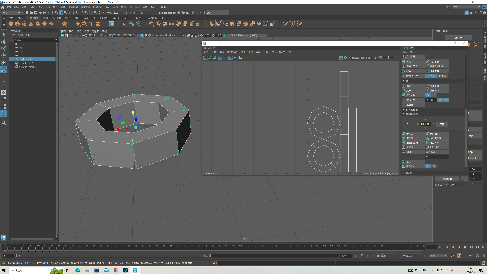
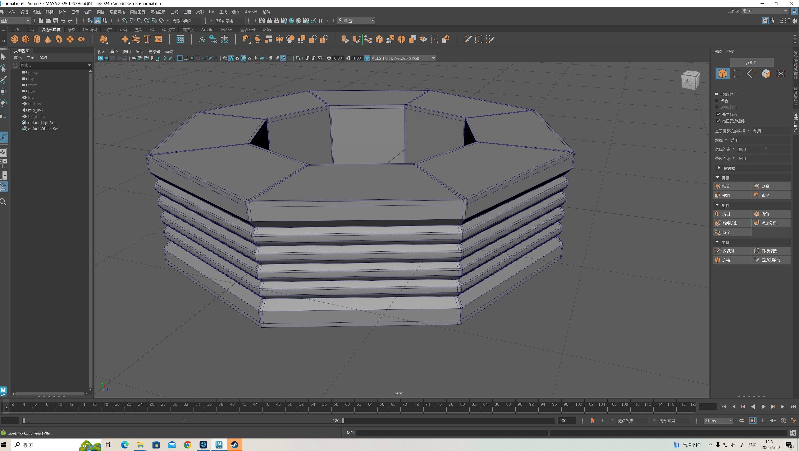
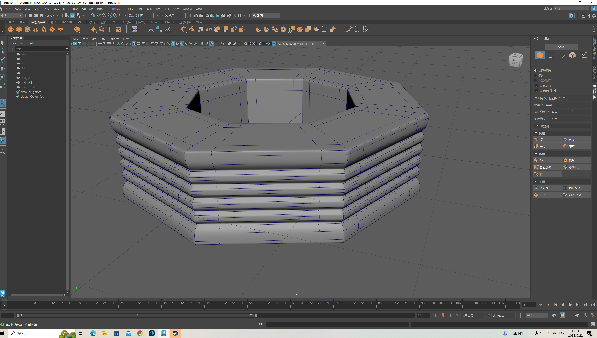
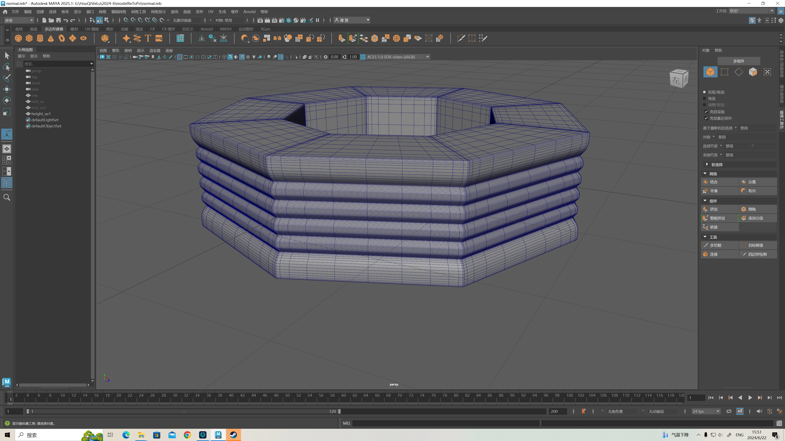
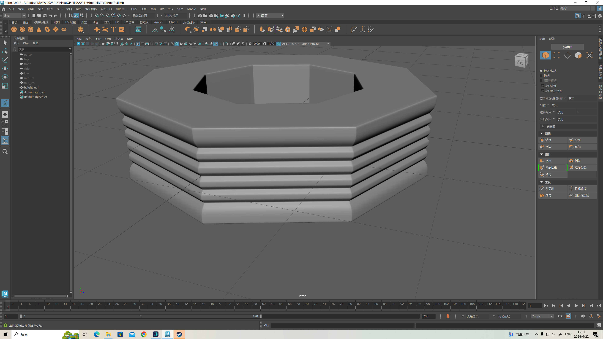
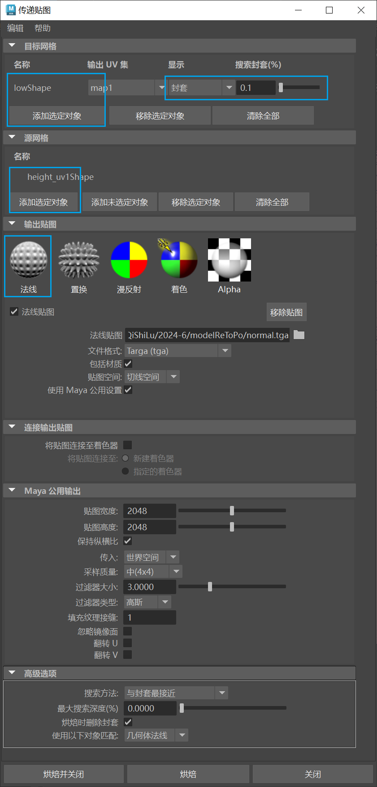
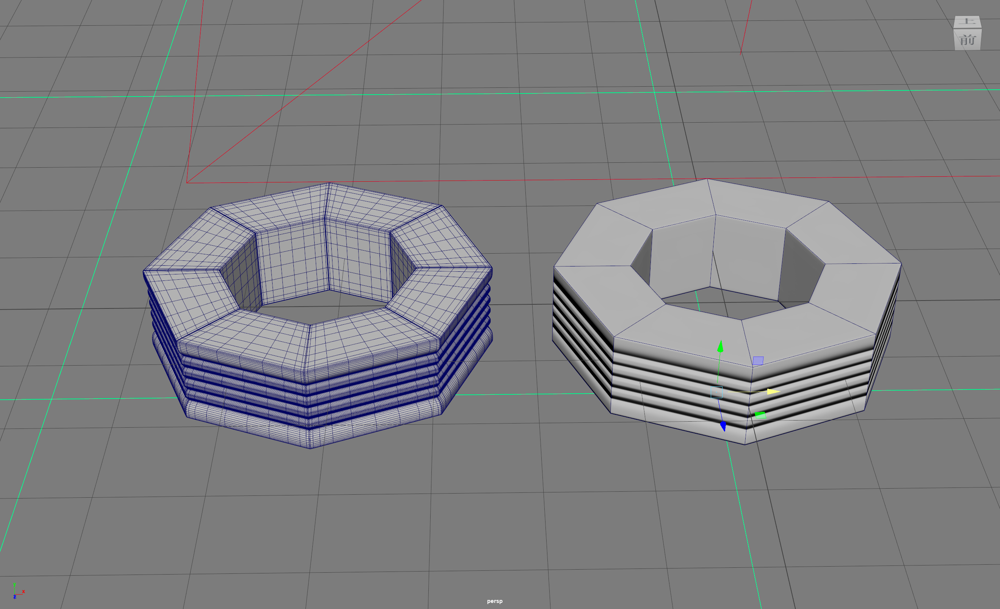
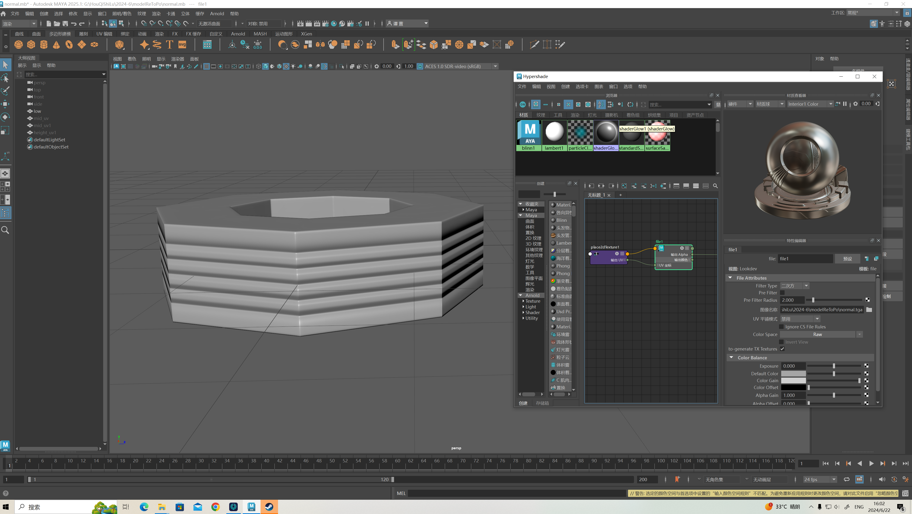
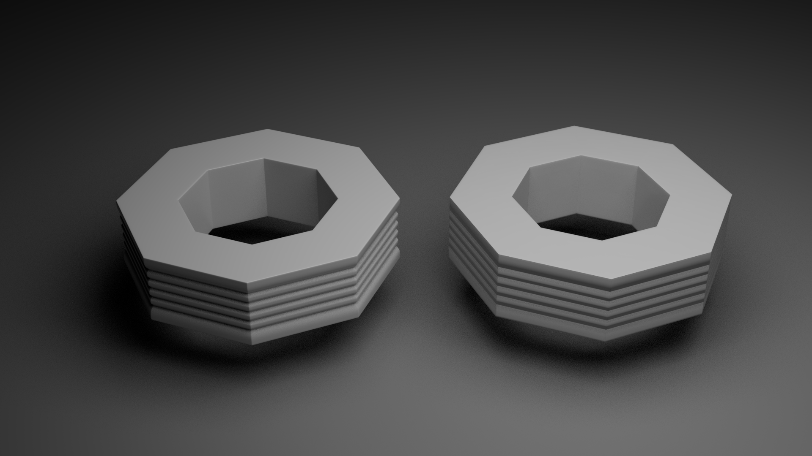
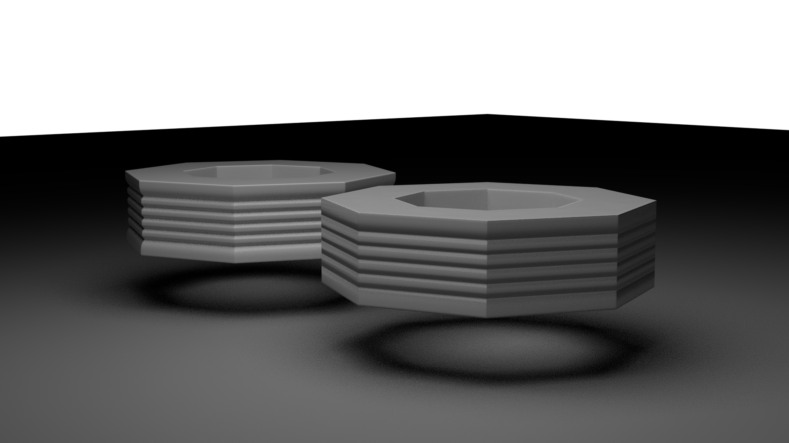

## 低模中模高模
### 低模

- 带UV（UV接缝在硬边）
- 软硬边

### 中模
- 造型是中模确定的，**也是整个流程最重要的部分**
- 需要严格布线，以便制作高模

按下平滑显示可以预览高模效果

### 高模
- 无需限制面数，相反，面数务必要足够高
- 不限制UV与低模一样
- 可以在中模的基础上打破四边面规则塑造更精细的结构

## 烘焙法线
### Maya

- 贴图空间选项：凹凸空间改为**切线空间**（游戏影视流程默认所有**从高模烘焙到低模的法线贴图的贴图空间都是切线空间**）
- 格式选择tga（无特殊要求，所有贴图格式选择tga）

### 效果
左高模，右低模

低模

arnold渲染对比，左高模右低模

注：法线烘焙的步骤也可以在SubstancePainter里进行。但是强烈建议在建模软件里进行，因为烘焙效果不对可以立刻调整UV，软硬边等等建模工作的问题。

[回到上级](./全流程.md)