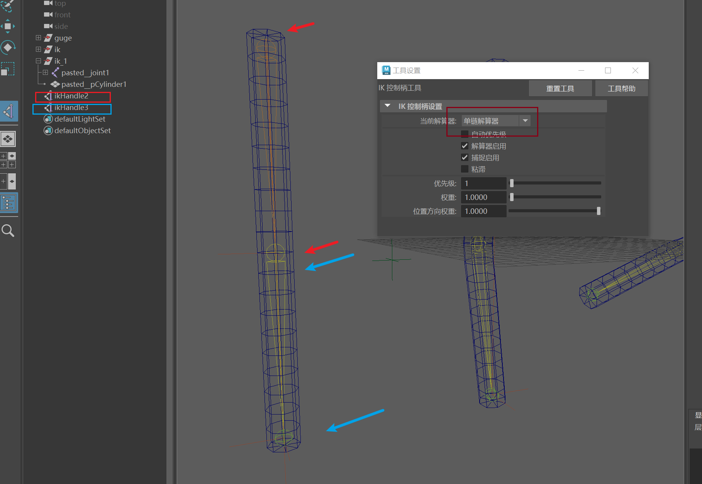

## 基础骨骼：

 
 
 
 
## ik-旋转平面解算器

 
 
 
这里注意。先选定位器再选ik控制柄
 
极向量约束
 
此时可以使用定位器控制了。

## ik-单链解算器
单段单段的关机创建单链解算器。

通过对单链解算器的分组来自由控制关节运动。

我理解的是，在保持关节长度的前提下，自由的控制关机的运动。即有关机的约束，又有组的自由度。是个很好但是很危险的东西。

## 控制器
设计：

各种约束方法可以尝试。方向是旋转约束

注意要保持偏移

## IK-FK切换

原理就是父子约束。

需要切换的关节段的每个关节都进行如上的父子约束：

于是我们只需要一个属性值来控制当前是ik还是fk即可。
操作：
- 准备阶段：

依次绑定父子约束

可以看到权值属性。

- fk

- ik
略。
- 项目细节
管理ik-fk控制手柄的颜色。

文字进行曲线提取。

## 受驱动关键帧

