## 封装
#### 创建
 全选节点，ctrl G分组
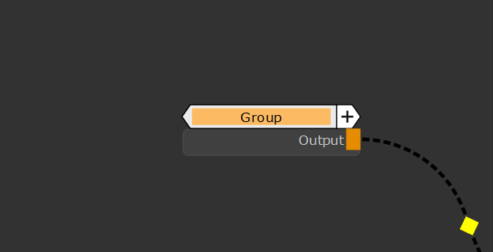
ctrl doubleclick进入组里。
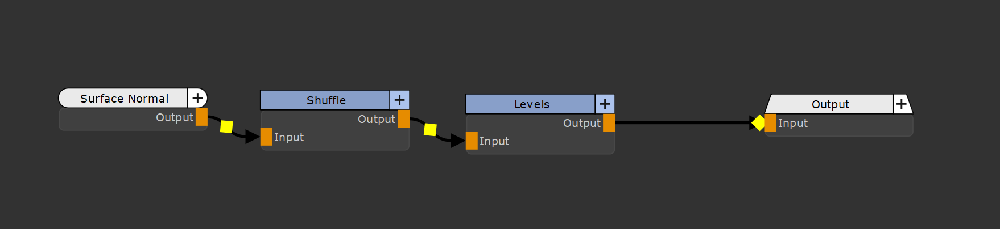
参数化，input和output。output只能有一个。

外部就会暴露input。
#### 参数化
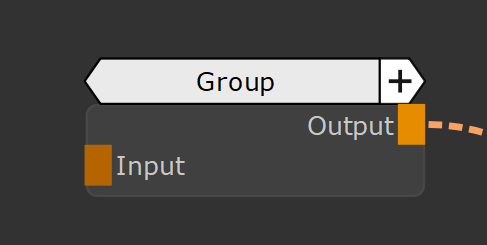
一些参数也可以暴露给外部调整。
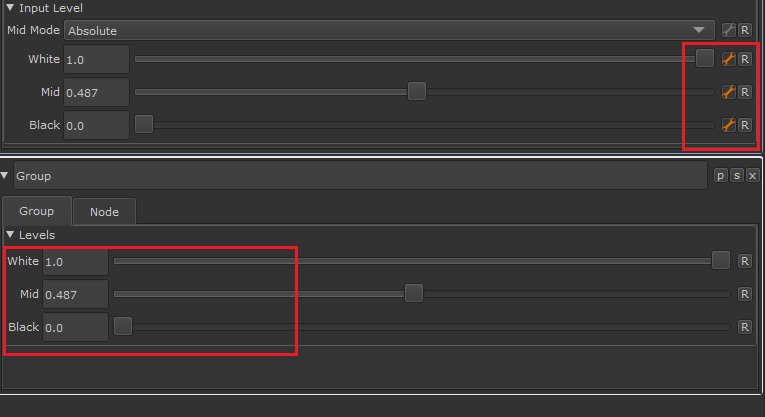

也可以这样选择。
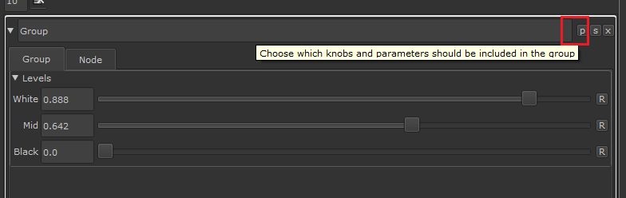
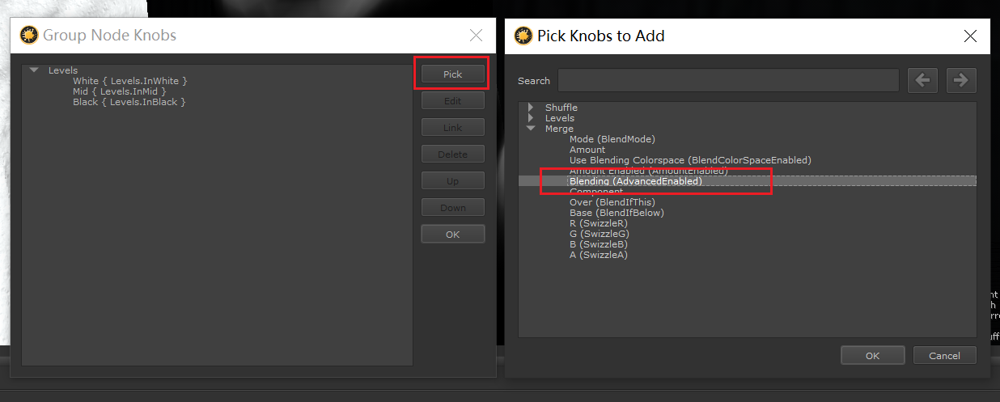
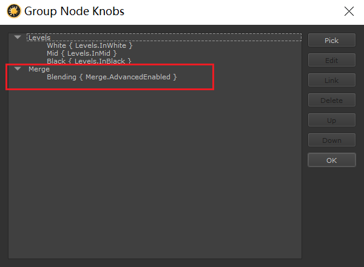
节点重命名之后没有更新就手动选择。
#### 导入导出
导出
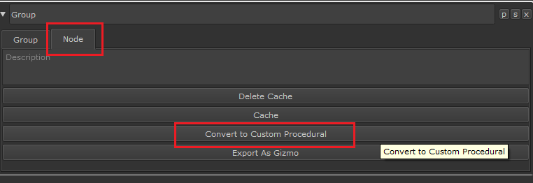
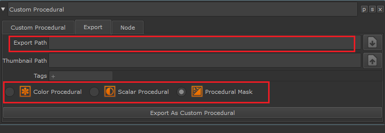
导入

## merge
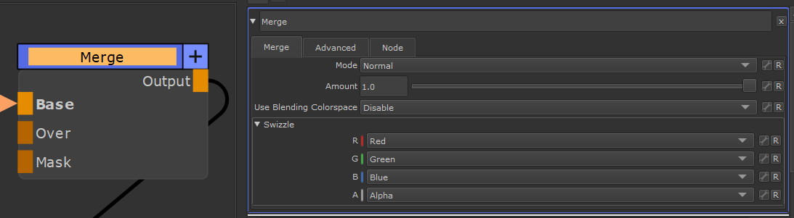
## 变化曲线
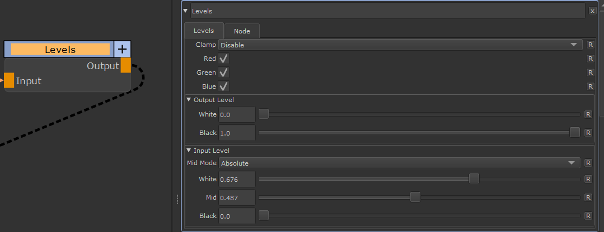
## 通道
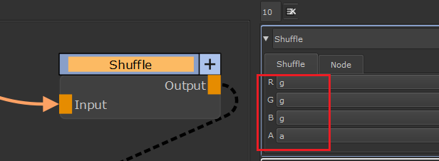
## 从模型得到
- 世界法线
可以得到三视图的光照信息。进行通道分离即可。
    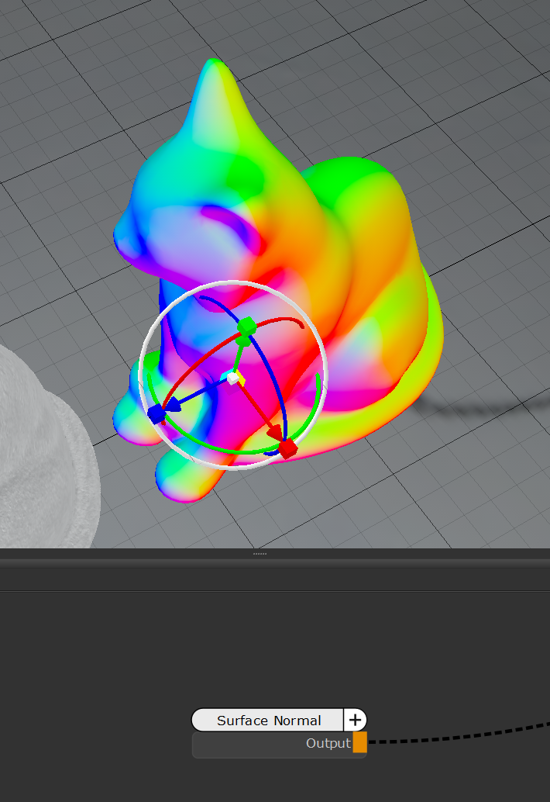
- 三面投射。
快速使用三个贴图投射整个模型。每个面都可以独立调整。
 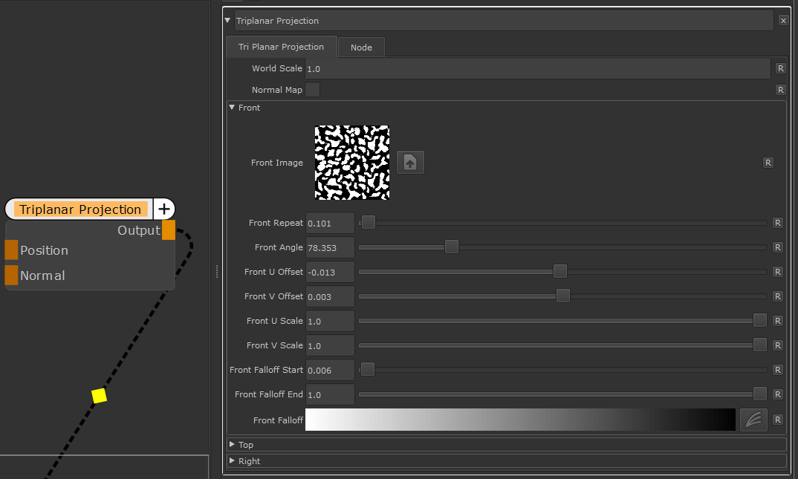