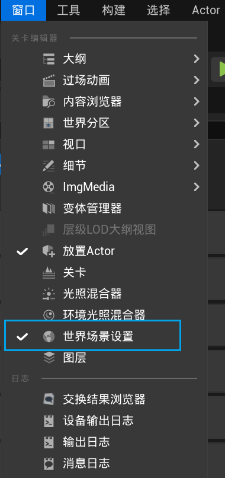
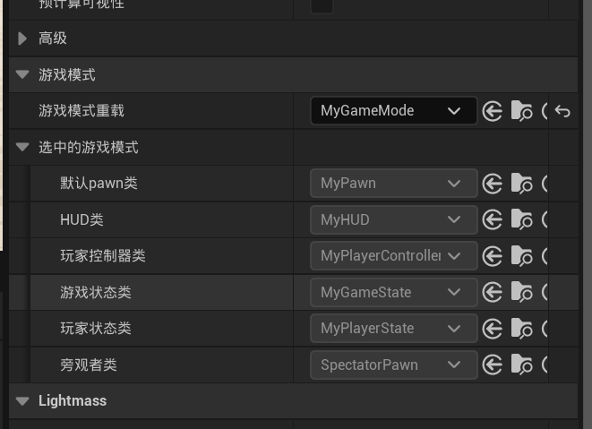
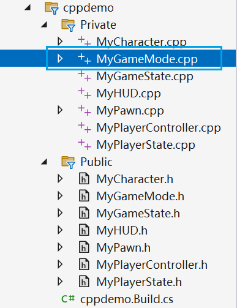

### 创建c++工程（略）
### ue c++工程的基本类

游戏模式类是最高的类。控制以下所有类
现在重载这些类，每个都自己来实现
ue 添加c++类(略)

细节面板：

visul studio



MyGameMode.h
```cpp

// Fill out your copyright notice in the Description page of Project Settings.

// 只编译一次的宏
#pragma once

#include "CoreMinimal.h"
// 自己补上这些头文件的包含
#include "MyPawn.h"
#include "MyPlayerController.h"
#include "MyPlayerState.h"
#include "MyGameState.h"
#include "MyHUD.h"
// 需要在generated头文件之前包含，否则报错？（为什么
#include "GameFramework/GameMode.h"
#include "MyGameMode.generated.h"

/**
 * 
 */
UCLASS()
class CPPDEMO_API AMyGameMode : public AGameMode
{
	GENERATED_BODY()
	AMyGameMode();// 构造函数

    // 非常重要的三个虚函数，代表着游戏的根本逻辑
	virtual void BeginPlay() override; // 游戏运行就执行beginplay
	virtual void Tick(float DeltaTime) override;// 游戏运行每一帧都执行
	virtual void EndPlay(const EEndPlayReason::Type EndPlayReason) override;// 当卸载关卡或者游戏退出调用
};

```
MyGameMode.cpp
```cpp
// Fill out your copyright notice in the Description page of Project Settings.


#include "MyGameMode.h"
// 游戲模式游戏模式
AMyGameMode::AMyGameMode() {
    // 这些就是上图的类
	this->DefaultPawnClass = AMyPawn::StaticClass();
	this->PlayerControllerClass = AMyPlayerController::StaticClass();
	this->GameStateClass = AMyGameState::StaticClass();
	this->PlayerStateClass = AMyPlayerState::StaticClass();
	this->HUDClass = AMyHUD::StaticClass();
}
// 都要调用父类的函数。
void AMyGameMode::BeginPlay()
{
	Super::BeginPlay();
}

void AMyGameMode::Tick(float DeltaTime)
{
	Super::Tick(DeltaTime);
}

void AMyGameMode::EndPlay(const EEndPlayReason::Type EndPlayReason)
{
	Super::EndPlay(EndPlayReason);
}

```