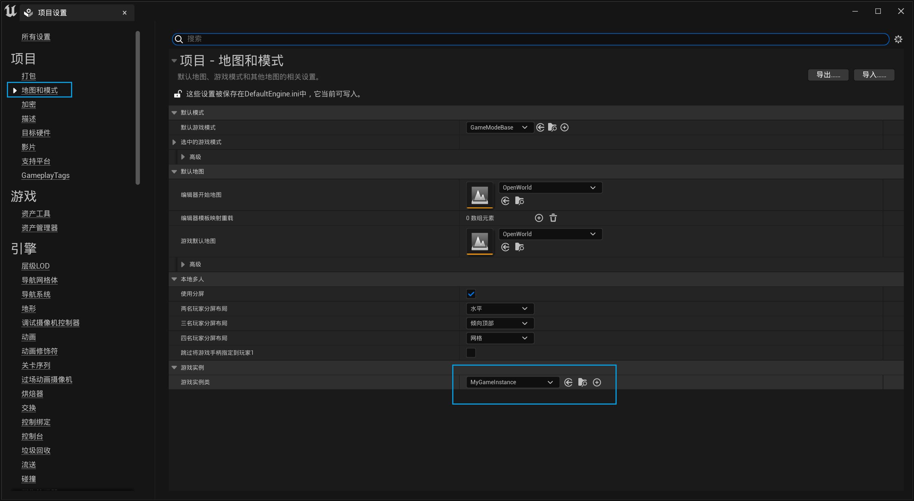

创建MyGameInstance类
运行之前改成自己的GameInstance

在MyPawn类内调试。
MyPawn.h
```cpp
#include "./MyGameInstance.h"
class MyPawn{
    public:
    	// 游戏实例
	UPROPERTY()
	UMyGameInstance* MyInstance;
}
```
MyPawn.cpp
```cpp
void AMyPawn::BeginPlay()
{
	Super::BeginPlay();
	this->MyInstance = Cast<UMyGameInstance>(GetWorld()->GetFirstPlayerController()->GetGameInstance());
	UE_LOG(LogTemp, Warning, TEXT("Instance: %d"), MyInstance->MyAPPID);
}
```

