从类创建蓝图
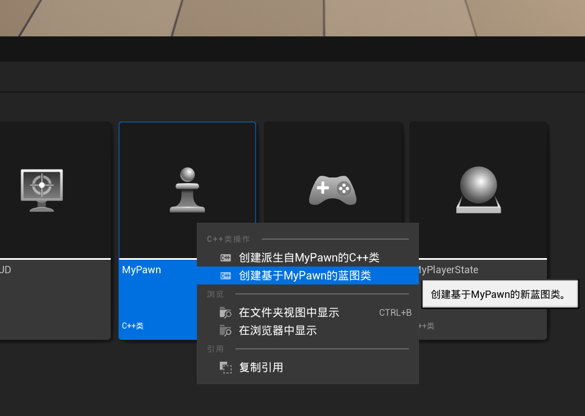
命名规范
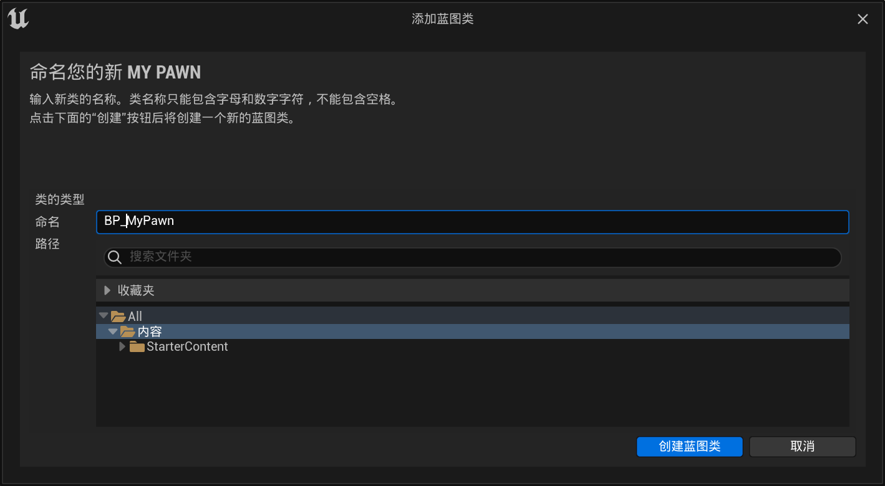


以下代码在MyPawn.h内测试
```cpp
// Fill out your copyright notice in the Description page of Project Settings.

#pragma once

#include "CoreMinimal.h"
#include "GameFramework/Pawn.h"
#include "MyPawn.generated.h"

UCLASS()
class CPPDEMO_API AMyPawn : public APawn
{
	GENERATED_BODY()

public:
	// Sets default values for this pawn's properties
	AMyPawn();

protected:
	// Called when the game starts or when spawned
	virtual void BeginPlay() override;

public:	
	// Called every frame
	virtual void Tick(float DeltaTime) override;

	// Called to bind functionality to input
	virtual void SetupPlayerInputComponent(class UInputComponent* PlayerInputComponent) override;

};

```

#### 可见
```cpp
public:
    UPROPERTY(VisibleDefaultsOnly)
    int32 VisibleDefaultsOnlyInt;
    // 仅仅在细节面板可见
    UPROPERTY(VisibleInstanceOnly)
    FString VisibleInstanceString;
    // 类默认设置和实例细节面板都可见
    UPROPERTY(VisibleAnywhere)
    FVector VisibleAnywherevector;
```
蓝图细节面板
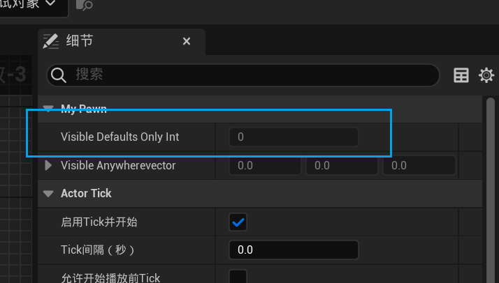实例细节面板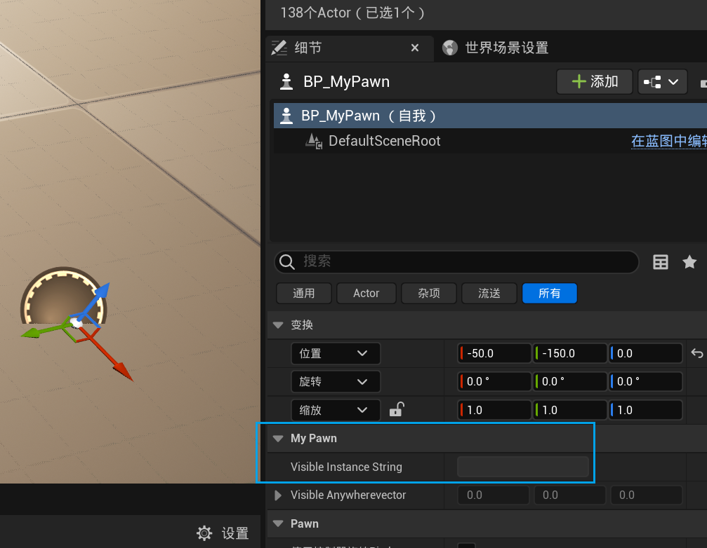

#### 可编辑
```cpp
public:
	UPROPERTY(EditDefaultsOnly)
	int32 EditDefaultsOnlyInt;
	UPROPERTY(EditInstanceOnly)
	FString EditInstanceOnlyString;
	UPROPERTY(EditAnywhere);
	FVector EditAnyWhereVector;
```
Blueprint
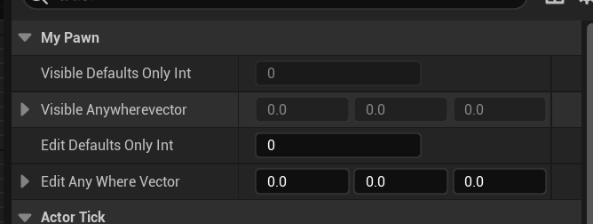
Instance
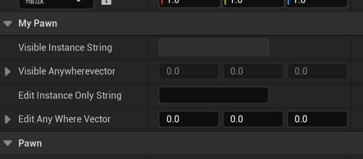

#### 蓝图可读写(与蓝图共享变量)
```cpp
public:
	UPROPERTY(EditAnywhere, BlueprintReadOnly)
	int32 BlueprintReadOnlyInt;
	UPROPERTY(EditAnywhere, BlueprintReadWrite)
	FString BlueprintReadWriteString;
```
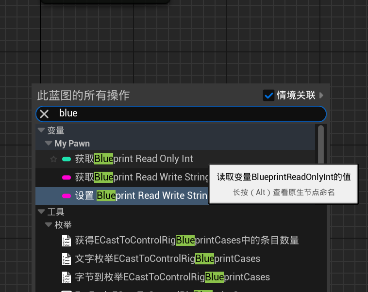

#### 文件夹分类整理
```cpp
public:
	// Category目录
	UPROPERTY(EditAnywhere, BlueprintReadWrite, Category = "MyIntValue")
	int32 Value1;
	UPROPERTY(EditAnywhere, BlueprintReadWrite, Category = "MyIntValue|MySubIntValue")
	int32 Value2;
```
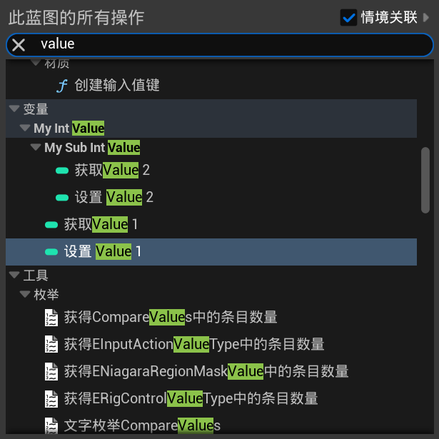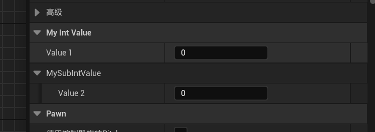

所有的变量也可以在类细节面板查看。只是加上蓝图相关的宏才可以在蓝图里获取

#### 别名
```cpp
public:
	// 别名
	UPROPERTY(EditAnywhere,BlueprintReadWrite,meta=(DisplayName="MyValue3DisplayName"))
	int32 MyValue3;
```


#### 条件可编辑
```cpp
public:
	UPROPERTY(EditAnywhere, BlueprintReadWrite, meta = (DisplayName = "controller"))
	bool isController;
	UPROPERTY(EditAnywhere,BlueprintReadWrite,meta=(EditCondition="isController"))
	float value3;
```
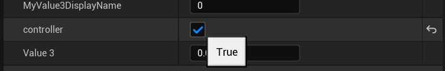

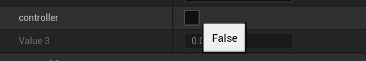
#### 变量名注释
```cpp
public:
	// 解释说明变量
	UPROPERTY(EditAnywhere, BlueprintReadWrite, meta = (ToolTip = "isControllerTrue"));
	bool isTrue;
```
鼠标悬停会弹出小界面解释该变量的含义
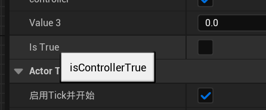