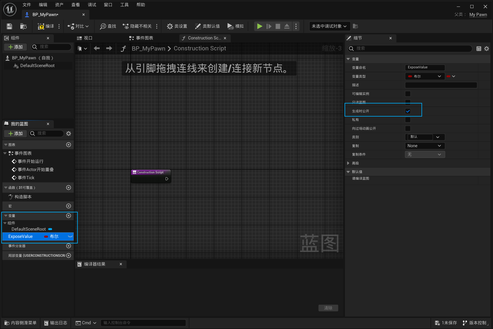

以下代码在MyPawn.cpp内书写

注意，声明结构体的结构体名必须是F开头。
~~~cpp
UENUM(BlueprintType)
namespace MyEnumType {
	enum MyCustomEnum {
		Type1,
		Type2,
		Type3,
	};
}
UENUM(BlueprintType)
enum class EMyTestEnum : uint8 {
	OneType UMETA(DisplayName = "OneType"),
	TwoType UMETA(DisplayName = "TwoType"),
	ThreeType UMETA(DisplayName = "ThreeType"),
};

USTRUCT(BlueprintType)
struct FMyTestStruct { // 必须是 'F '开头 。
	GENERATED_USTRUCT_BODY()
	UPROPERTY(EditAnywhere, BlueprintReadWrite, Category = "MyTestStruct")
	int32 Health;
	UPROPERTY(EditAnywhere, BlueprintReadWrite, Category = "MyTestStruct")
	FString MyName;
};


~~~

再在Pawn类内声明这些结构体和枚举的实例：

```cpp
public:
	// 枚举
	UPROPERTY(EditAnywhere,BlueprintReadWrite,Category = "MyEnum")
	TEnumAsByte< MyEnumType::MyCustomEnum> MyCustomEnum;

	UPROPERTY(EditAnywhere,BlueprintReadWrite,Category = "MyCustomStruct")
	FMyTestStruct MyCustomStruct;

	UPROPERTY(EditAnywhere, BlueprintReadWrite, Category = "MyEnum")
	EMyTestEnum MyCustomEnum1;
```

蓝图生成时暴露：
枚举类型可以在创建变量时将创建的变量的类型设置为你声明的枚举类型：

```cpp
public:
	// 蓝图生成时暴露:使用元数据说明符 ExposeOnSpawn
	UPROPERTY(EditAnywhere, BlueprintReadWrite, Category = "MyExposeOnSpawn", meta = (ExposeOnSpawn = "ExposeOnSpawnValue"))
		int MyHealth;
```
等价于在UE里这样操作：

更多细节查看官网：
