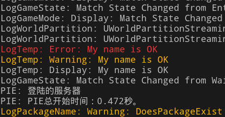
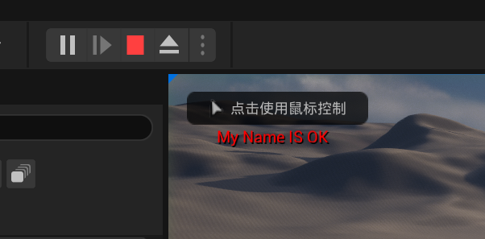

## 调试

在MyGameMode.BeginPlay函数测试输出语句
```cpp
// 虚幻输出文本内容到控制台
//params参数： 临时日志类别名称，日志记录级别 文本内容
// 日志记录级别
// Error Waring Display 级别从大到小
UE_LOG(LogTemp, Error, TEXT("My name is OK"));
UE_LOG(LogTemp, Warning, TEXT("My name is OK"));
UE_LOG(LogTemp, Display, TEXT("My name is OK"));
// 打印到屏幕上
// 默认值， 打印时间，打印颜色，文本内容
GEngine->AddOnScreenDebugMessage(-1, 5.0f, FColor::Red, TEXT("My Name IS OK"));
```

窗口>输出



## 数据类型
