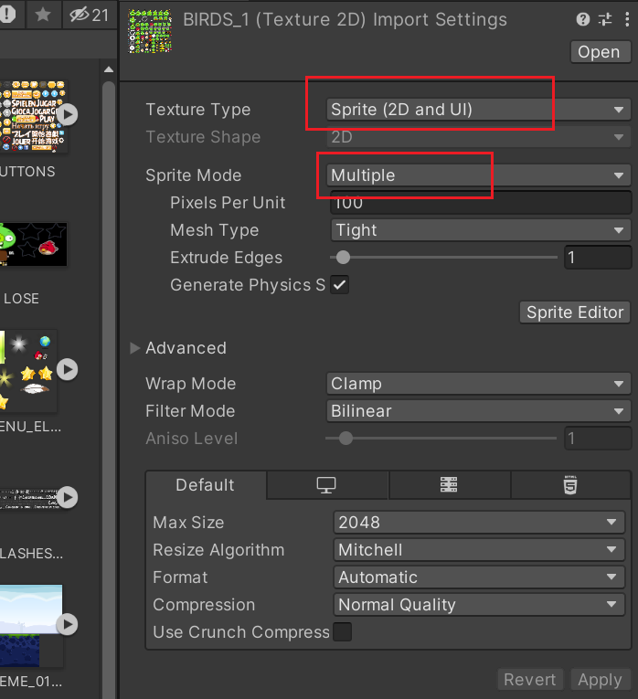
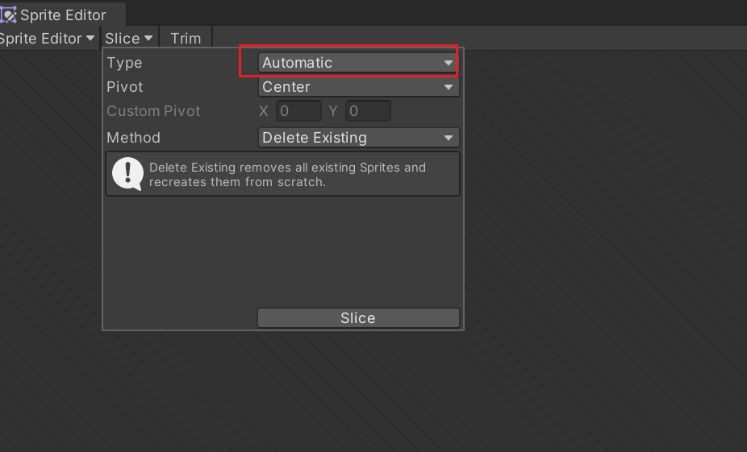
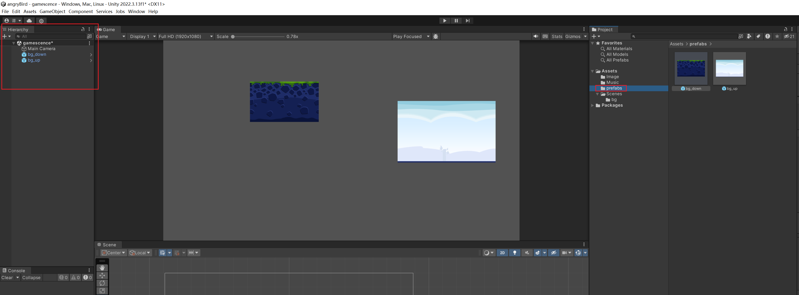
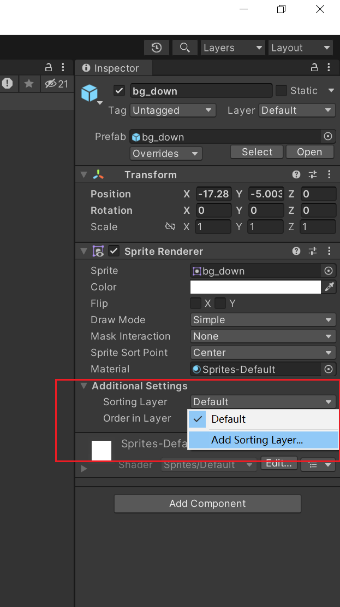
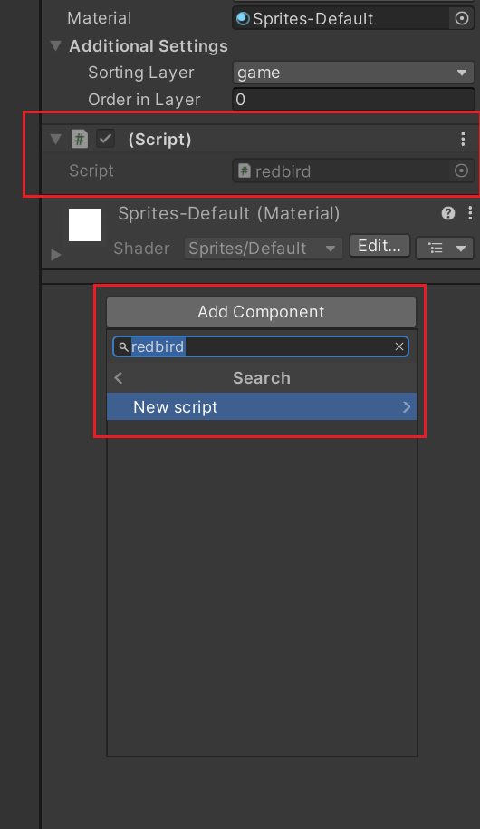
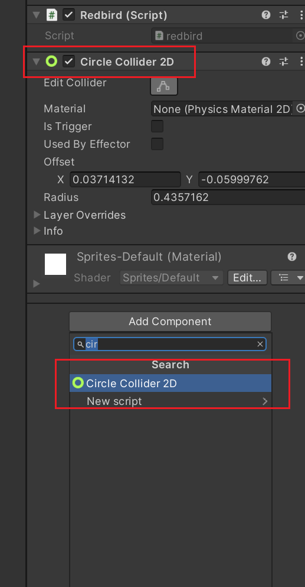
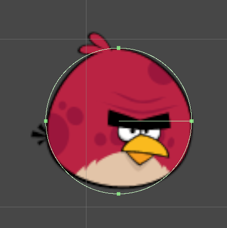

Asset里面是整个项目的文件。
Asset子文件里有：
- Scences 
  - 游戏场景文件。里面的一个文件管理整个工程。点开它就是大纲视图
  - 这个文件夹是整个工程的main文件。
- script
  - 脚本文件。也是很重要的。
- prefabs
  - 预加件

素材分割办法

点开sprite Editor

自动切割。不是自动的话就手动拖拽就好了。

预加件。创建prefabs文件。
素材拖拽到主窗口，再在大纲视图拖拽到Assets里的prefabs文件夹即可。

游戏层

为对象添加脚本
记得把脚本拖拽到script文件夹下方便管理。

给对象添加组件。Script，Collider都是很重要的组件。

编辑物体的Collider
