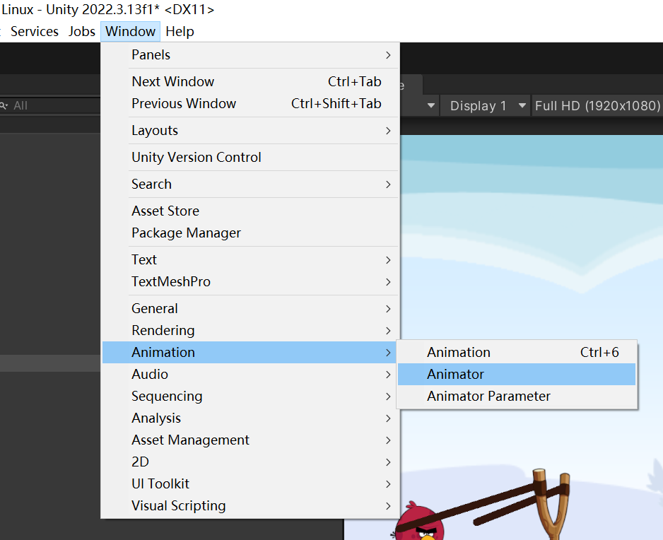
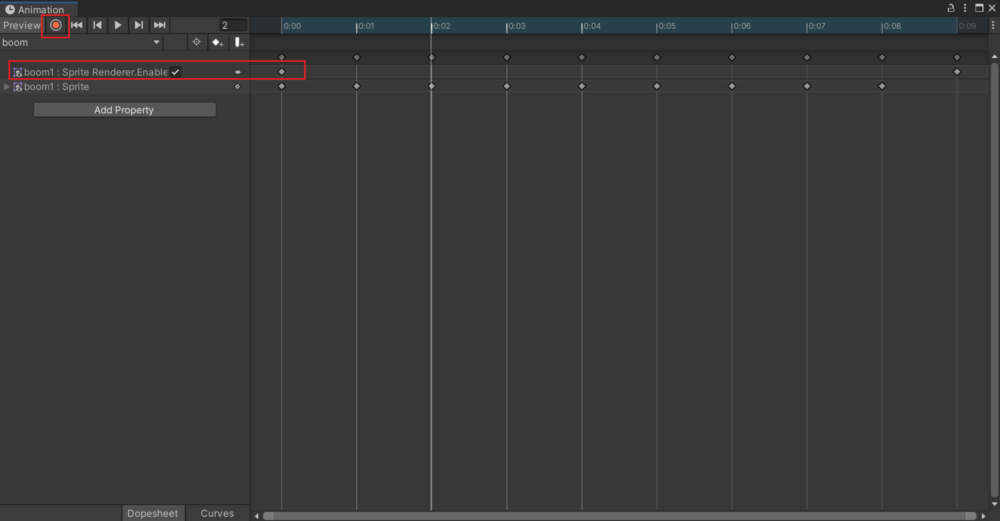
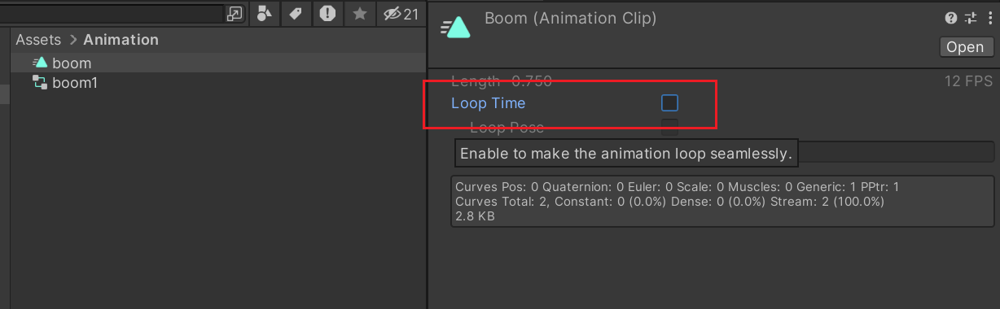

image文件夹下多选命名好的帧sprite。
拖拽到大纲视图里，就会弹出文件创建框。

修改帧动画

录制。添加其他属性。(可用性开启关闭)

不循环

boom动画的代码：
~~~csharp
using System.Collections;
using System.Collections.Generic;
using UnityEngine;

public class boom : MonoBehaviour
{
    // Start is called before the first frame update
    void Start()
    {
        Destroy(gameObject,1f);
    }
}

~~~

一秒钟之后销毁