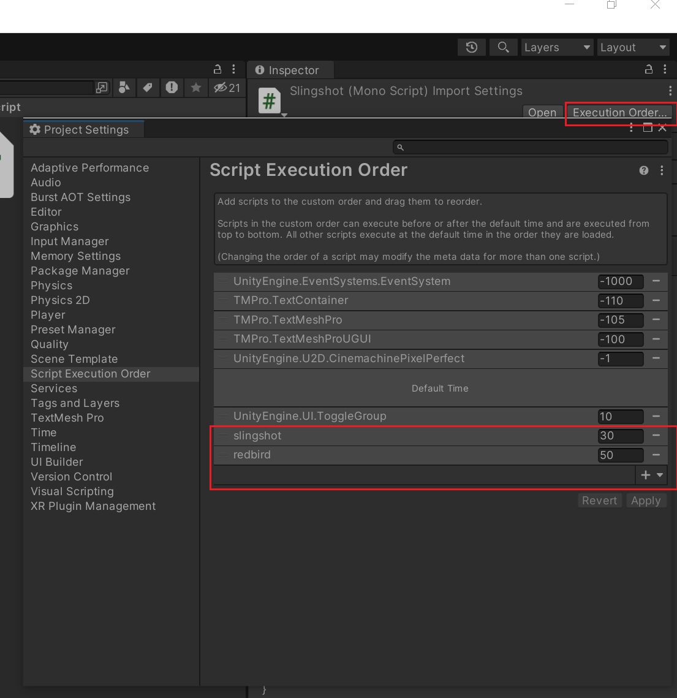

~~~csharp
void Awake(){

}
~~~
|函数名|简介|
|:---:|:---:|
Awake|这是对象实例化时的第一个调用。它用于在游戏开始之前初始化变量或游戏状态。这个方法在对象整个生命周期中只被调用一次。
OnEnable|当对象变为可用（例如，当一个场景开始时，或者一个被禁用的游戏对象被重新启用时）时调用。这个方法可以用于重新初始化在对象禁用期间可能已丢失的资源。
Start|在对象的第一帧更新之前调用。它是除Awake外另一个在游戏开始时被调用的方法。通常用于设置初始状态或启动行为。
FixedUpdate|这是每固定物理步长被调用一次的方法。它用于处理与物理相关的更新，例如移动、旋转等。
Update|在每一帧中调用。它用于处理实时事件，如用户输入、移动对象、触发事件等。
LateUpdate|在每一帧的最后调用，用于处理需要在所有其他更新完成后才能进行的更新，例如跟随相机。
OnDisable|当对象变得不可用（例如，场景结束或对象被禁用）时调用。这个方法通常用于清理资源，例如销毁游戏对象或取消订阅事件。
OnDestroy|在销毁对象之前调用。这是对象生命周期中的最后一个调用，用于进行最后的清理工作，如释放内存或保存游戏状态。

但是，多个对象如何调控哪个先初始化呢？比如Awake方法？如何决定谁先呢？

更改脚本属性即可。