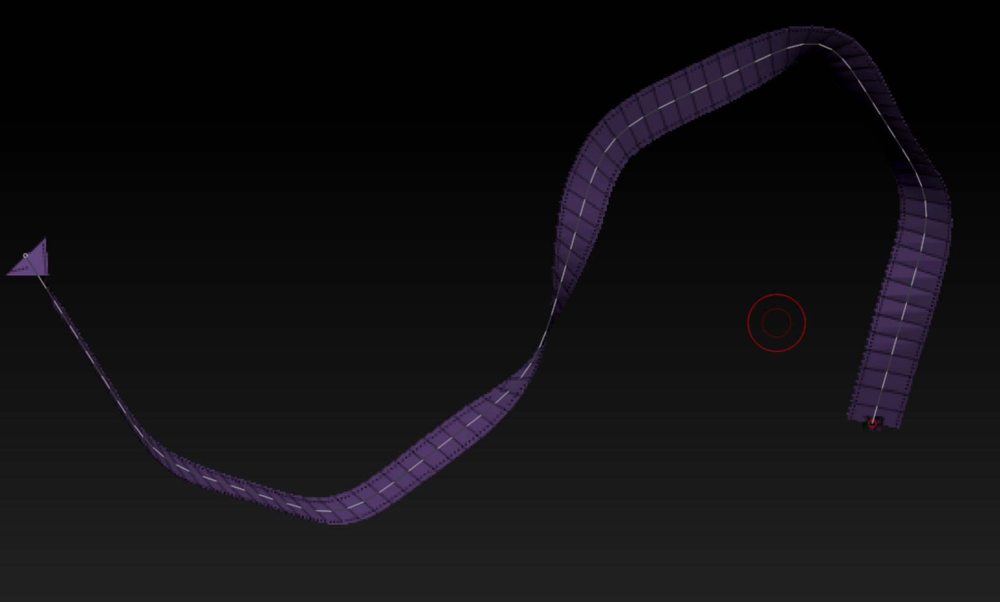

### ZSphere工作流
#### 1.制作大型
子工具托盘里选择z球笔刷

在视口中央拖拽第一个z球

**点击编辑模式**

拖拽.其实之后对z球的编辑都是D M S R三个笔刷的操作.

&emsp;Draw绘制(从激活z球创建新的z球,红色的就是激活z球.LMB单击激活z球)
&emsp;Move移动激活z球
&emsp;Rotate旋转z球
&emsp;Scale缩放z球
下图展示单机z球可以激活并操作,以实现分支和修改大型.

#### 添加删除z球
Draw模式下,按住**alt**键**LMB单击**叶子结点即可删除.
这些条件都要满足.
Draw模式下,**LMB单击**结点之间的连接体可以创建z球

## alt(opt)键在zbrush里是删除的意思.^总结^
以上操作可以使我们的z球推出任何的大型.
#### 2.转为网格体

预览网格体

快捷键 **A**
参数可以调整.最好把面数给到0.不然很卡,

注意这里只是预览并不是真的生成了模型.按下快捷键A又可以恢复的.而且不能细分等等操作.

生成模型

可以在子工具中看到它

手动append一下,就可以了!

#### 3.转为曲线
笔触菜单

子工具就会有这个曲线。曲线头是立方体。

选择这个笔刷

点击曲线就会有效果。笔刷大小控制这个形状粗细。

调整分段（笔触菜单下的子菜单）

粗细变化

移动的情况下按住**ctrl** 拖拽实现扭曲。

做好了点击方块结束编辑模式。
