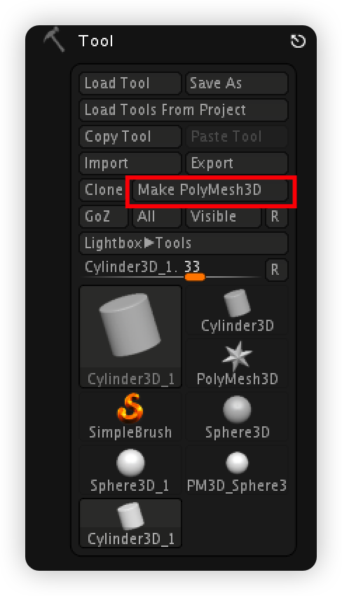

新来到zb要学会创建物体.先要有点东西编辑.
## 创建物体
zbrush原来是一个2.5D的浮雕绘制软件.从命名zbrush来看就知道它是可以画出高度(z轴)的笔刷.因此,这些历史原因让我们不得不进行一些手动的配置才能正常的进行3D雕刻.
##### 1.工具菜单托盘里选择你想要的几何基本体.

工具栏的这五个是非常常用的编辑模式.
分别为:
&emsp;1.Edit(切换编辑模式,2.5D - 3D) 快捷键 **T**
&emsp;2.Draw(在该工具的自己的模式下绘制) 快捷键 **Q**
&emsp;3.Move(移动) 快捷键 **W**
&emsp;4.Scale(缩放) 快捷键 **R**
&emsp;5.Rotate(旋转) 快捷键 **E**

这些快捷键要记住.
##### 2.现在按下Q键,鼠标在主窗口拖拽出几何基本体(因为前面选择的工具的绘制模式就是拖拽).

##### 3.现在按下T键切换编辑模式.选择笔刷(默认有standard笔刷可以不用调整什么)

阅读提示.我们使用的2.5D笔刷工具绘制的不是3D网格,需要转换为3D网格.
##### 4.生成3D几何体网格(Make PolyMesh3D)

但是现在还是有许多杂物,我们可能根本找不到我们生成的那个3D几何体网格在哪里.
##### Tool面板
每个卡片都是一个工作区，工作区保存有各种物体。可以互相导入。

##### 5.清除画布
按下 **ctrl N** 清除画布.

##### 6.主视图基本操作

| 操作名称 | 快捷键 | 鼠标作用对象 | 鼠标动作模式 | 
| :-----: |:-----: |:-----: |:-----: |
| 平移| **alt LMB(RMB)** | 画布空白处 | 拖拽 | 
| 旋转|**LMB(RMB)**|画布空白处|拖拽|
|缩放|**alt^松开^ RMB(RMB)**|画布空白处|拖拽^最好上下拖拽^|

是的,操作很奇怪.但是熟练了就非常方便,因为zb的快捷键非常灵活的!