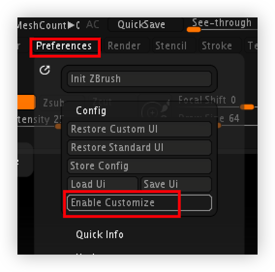
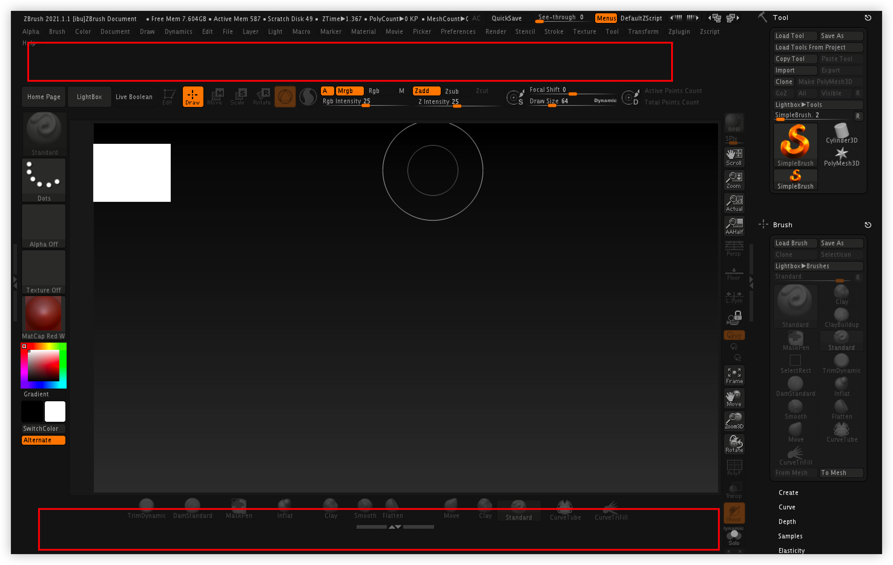
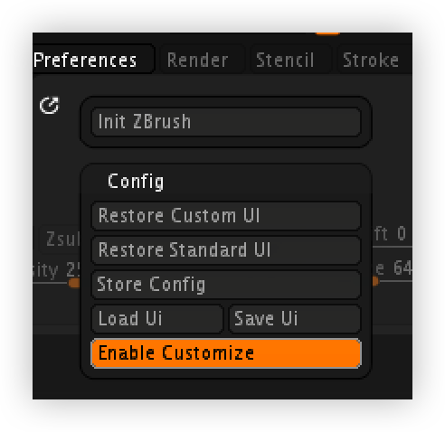
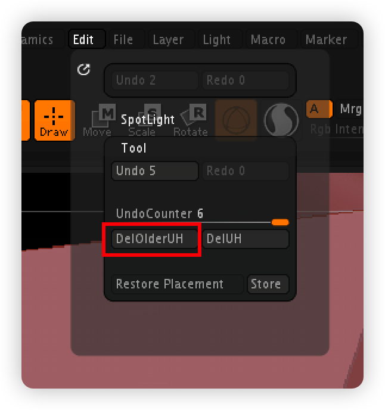
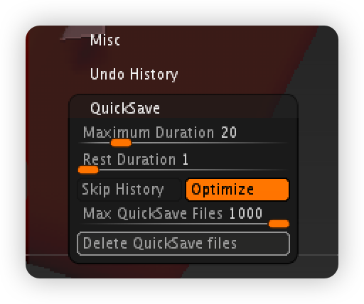
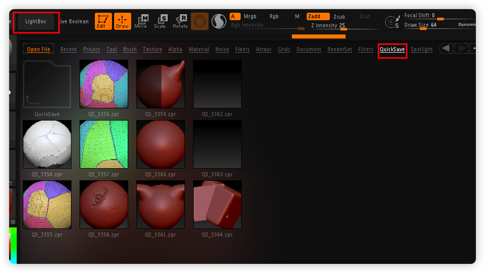
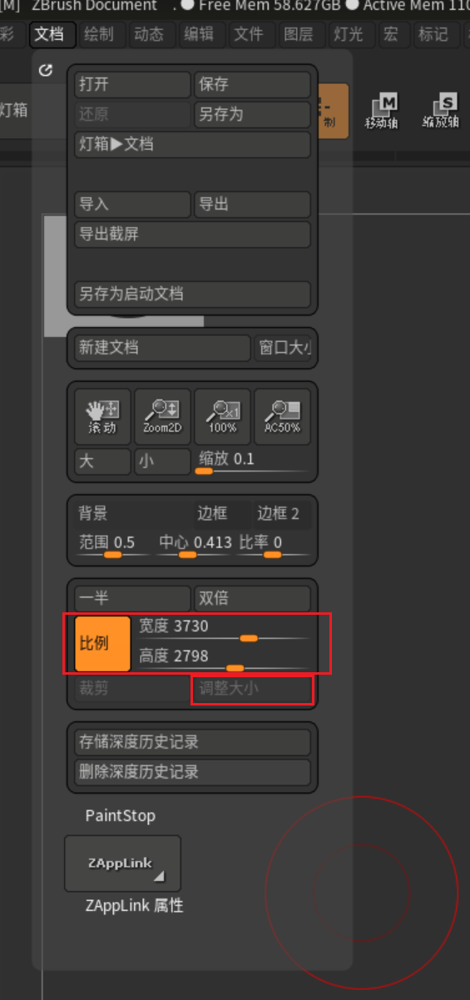
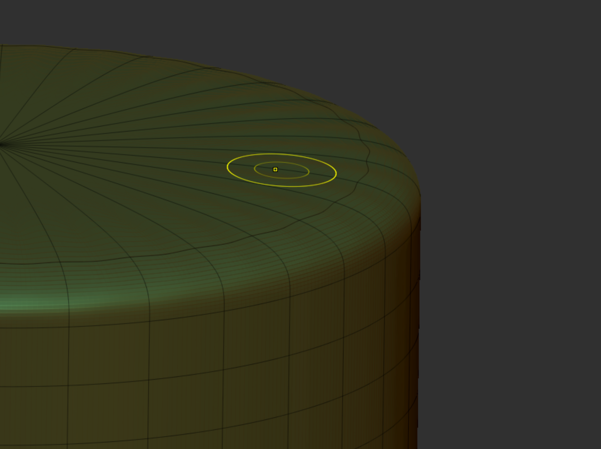
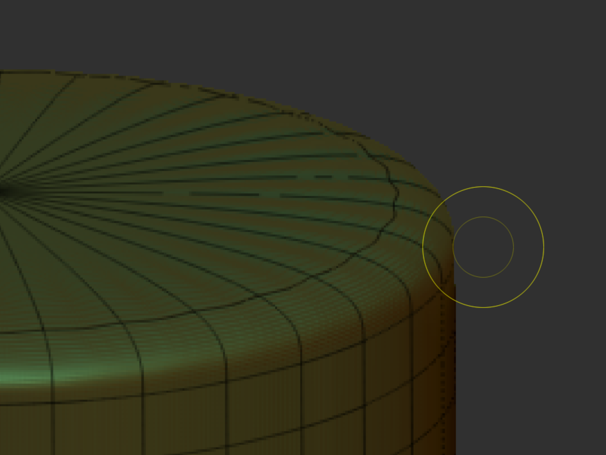
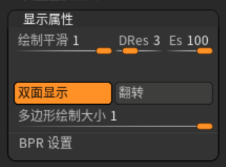

## 基本配置^操作^
### 1.UI自定义.
#### 1.1自定义办法

按下 **ctrl alt LMB** 可以把界面上的任意按钮拖拽到红色矩形的两个区域.
不要了拖回去即可.

橘色高亮点击退出UI模式.

#### 2.历史记录

UH是undo history

#### 3.自动保存
灯箱(LightBox)会自动保存我们的作品.很占内存
perference > QuickSave > Delete QuickSave files

灯箱保存的文件在这里查看:

## 灯箱(LightBox)^概念^
是一个快捷菜单.保存有许多预设模型
快捷键"**,**" 就是英文的逗号.很快捷.

#### 4.文档大小
画面总是有锯齿，那是主视图的渲染设置问题。

调整文档大小可以解决这问题。
第一张是4K，第二张是1K。对比很明显。

#### 5.模型双面显示
tool（工具菜单托盘）打开双面显示
