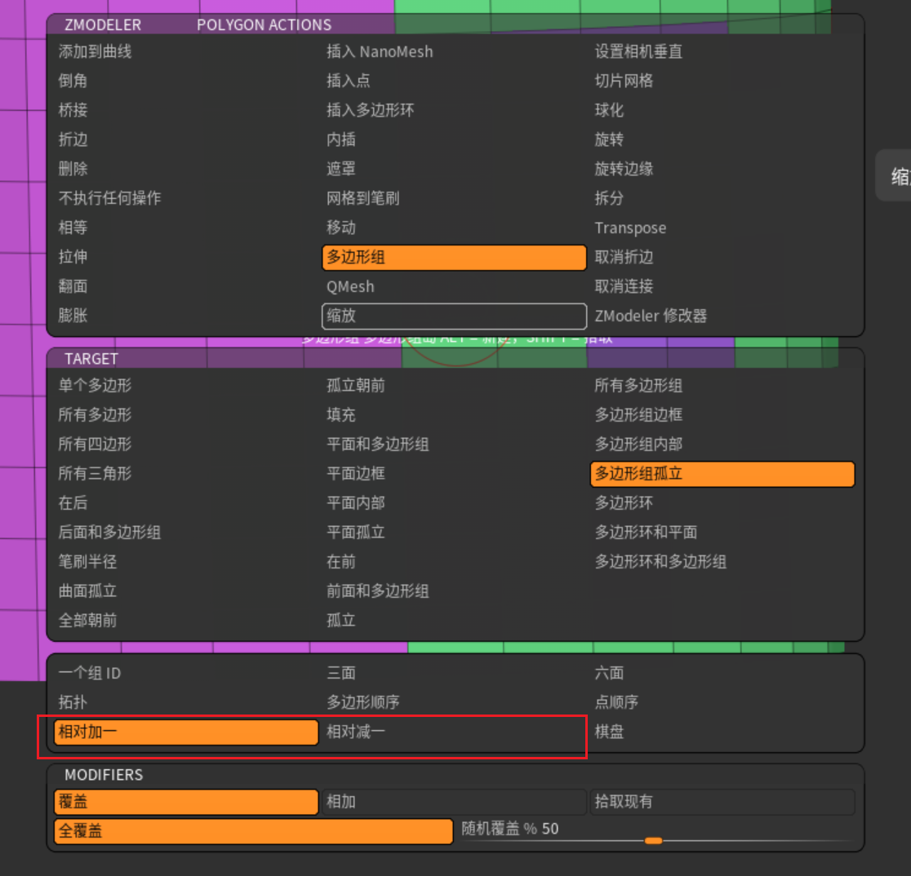

## 多边形组
### 低模的办法
zmodel笔刷
基本功能就是分组，调整。

zmodel笔刷，放到物体的哪里就是哪个层级的操作。放到点就操作点，放到面就操作面，放到线就操作线。
放到面上。**space**呼出快捷菜单选择模式。

**alt LMB** 拖拽选择面

**LMB** 单击创建组

注意，这里的组都是自由创建。一个颜色一个组。我们指定组该怎么办呢？
拾取组
**LMB按下 shift**拾取组信息。
接下来正常创建组。可以覆盖错误的创建和调整组。

现在修正完错误的部分了，现在要创建新组了。怎么覆盖掉拾取信息？

相对加一相对减一都是用于组颜色ID的。

可以看见新创建的组颜色不一样，而且差别不大。
在多边形组孤立的模式下，持续单击这个新组，颜色会持续变化，直到满意为止。

### 范围分组
1. 划定范围
2. 选择模式
   
3. 单击中间的多边形孤岛
4. 创建结束

### 高模的办法
[大型.md](./大型.md)
裁剪笔刷这里，
|笔刷族|动作|
|:----:|:----:|
|clip|截面不新建组|
|knife|截面新建组，布线截面横平竖直，边缘自适应|
select|选择隐藏|
slice|仅创建组|
triml|截面创建新组，布线整个截面自适应

里讲到的clip笔刷（夹笔刷）
ctrl shift呼出这一系列笔刷，模型上面拖拽，按下**sapce**移动，**alt**反转，松开LMB完成clip。可以制作钉子的效果。

这些就是clip区域。
不想穿过模型背面就上mask

clip的笔刷模式该为曲线，

从空白处向模型拖拽，黑色区域就是被裁切的。

**alt alt**尖角转折 **alt**平滑转折
**space**整体移动裁切线（不要松开**ctrl shift**）

**ctrl W**将显示的多边形组分为一组
我们通过反复的隐藏，显示，裁切来实现归并组，拆组等各种操作。
### 从遮罩创建组
绘制遮罩，ctrl w 即可
ctrl shift 隐藏
分组合并 隐藏不要的组，可视的组ctrl w就可以合并了
### 对称组
变形->镜像 
把模型的做好部分移到x轴左侧。

几何体编辑->修改拓扑->镜像并拓扑

实现镜像组。

### 应用
按组抛光

组间的布线就会平滑。不会有锯齿。

侦测边缘打开，自动侦测硬边。其余的不过多解释。平滑组防止把组形状平滑。
**反复的ZRemesher和按组抛光**可以得到相对布线规整的低模。
几何体编辑器->折边可以根据组创建折边。

在一级细分创建折边，细分一次，折边的地方就不会被细分算法影响。然后删除折边。此时折边已经被保留。接下来正常细分和雕刻，折边都会存在。

这是硬表面主流的做法。