## 创建大型
几个办法：
1. [z球创建大型](./ZSphere工作流.md)
2. [几何基本体](./创建物体.md)
3. [投射盒子](./投射盒子.md)
4. 灯箱模板
## 调整大型
1. 基本模式
 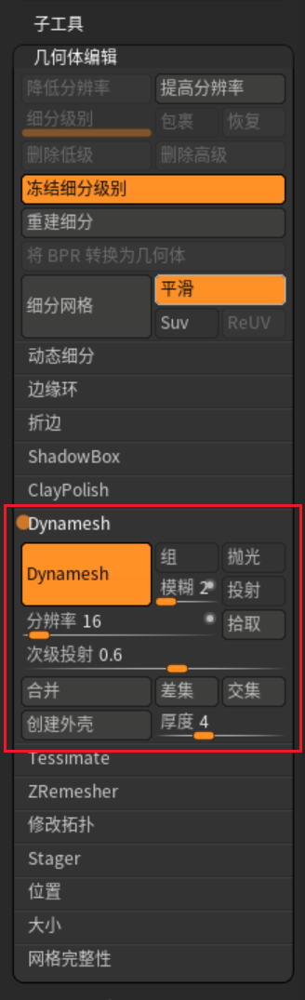
几何编辑器->动态拓扑。
**ctrl LMB 单击空白处** 重新构建网格。
1. 裁剪模型
   **ctrl shift** 呼出裁剪笔刷
   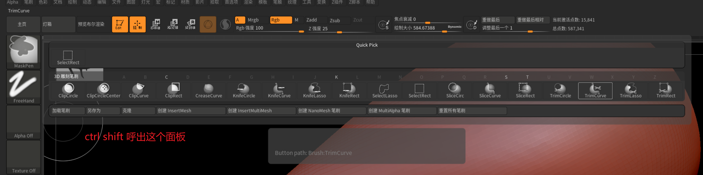
   裁剪笔刷分几组。
   
   [多边形组.md](./多边形组.md)里有详细介绍这些分类。这里只使用裁剪功能调整大型。
   实例模型：
   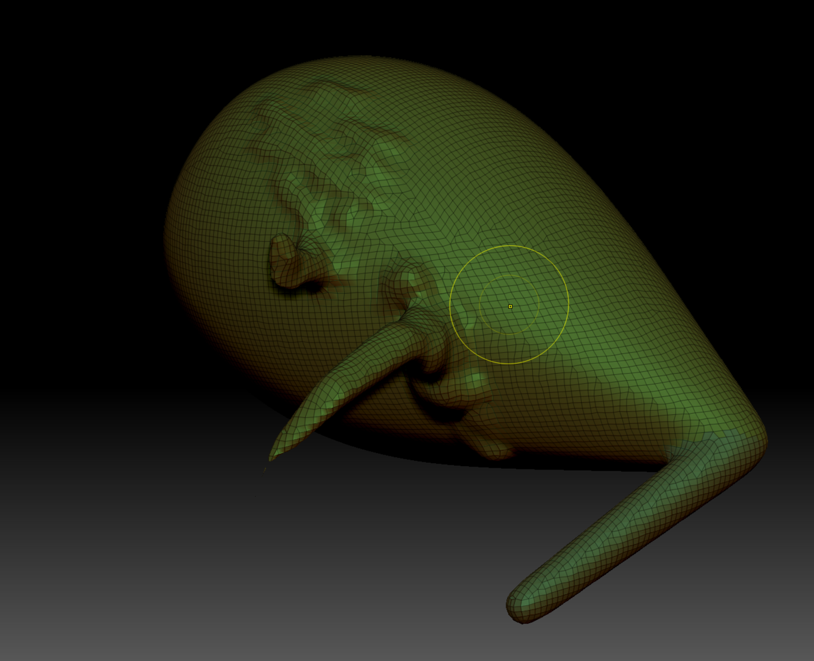
   第一组是夹笔刷。把剩余的模型压到切面，效果：
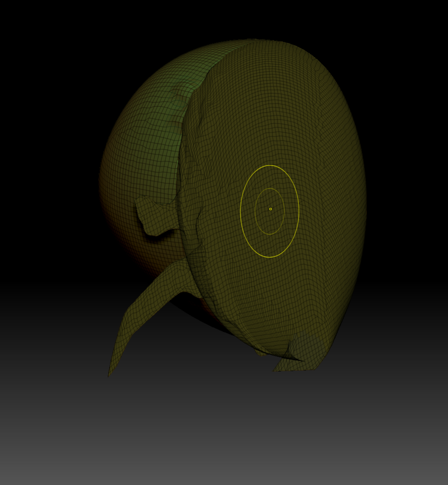
第二组是创建折痕边(crease)笔刷。
第三组是裁剪笔刷。直接裁剪，边缘布线自适应，切面平整。
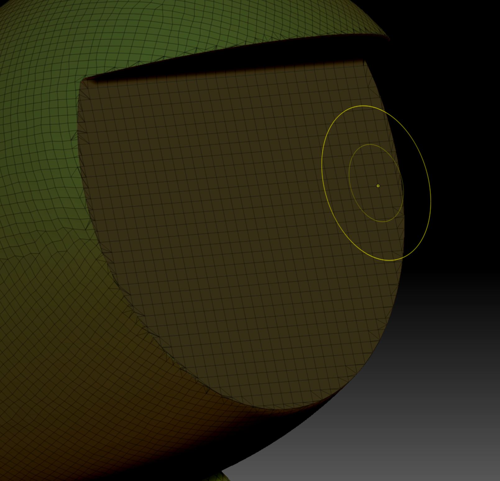
第四组是选择笔刷。选择模型部分面。

| 操作名称 | 快捷键 | 鼠标作用对象 | 鼠标动作模式 | 
| :-----: |:-----: |:-----: |:-----: |
|显示所有|**ctrl shift LMB**|空白|单击|
反向显示|**ctrl shift LMB**|空白|拖拽|
隐藏模型部分面|**ctrl shift alt LMB**|模型显示的部分面|拖拽|
显示模型部分面|**ctrl shift LMB**|模型显示的部分面|拖拽|
隐藏的方式可以实现更加工程化的裁剪。因为隐藏可以与多边形组结合，会非常灵活高效。
这里不考虑暂时。即使不使用更广的技术，隐藏也可以自由的画出想要裁剪的范围，然后一次实现裁剪。
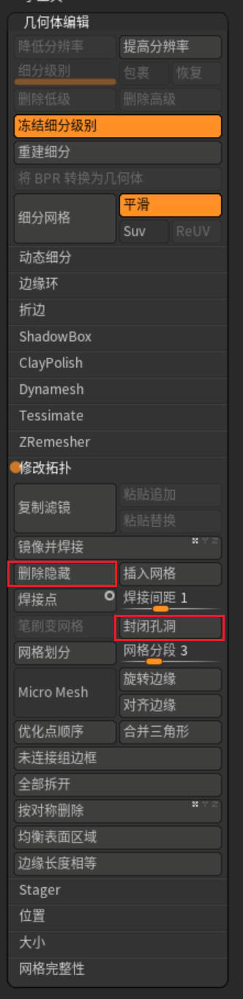
点击这两个按钮实现隐藏裁剪。
第五组是裁剪笔刷。直接裁剪，布线切面自适应。切面相对平整，因为考虑整体布线。
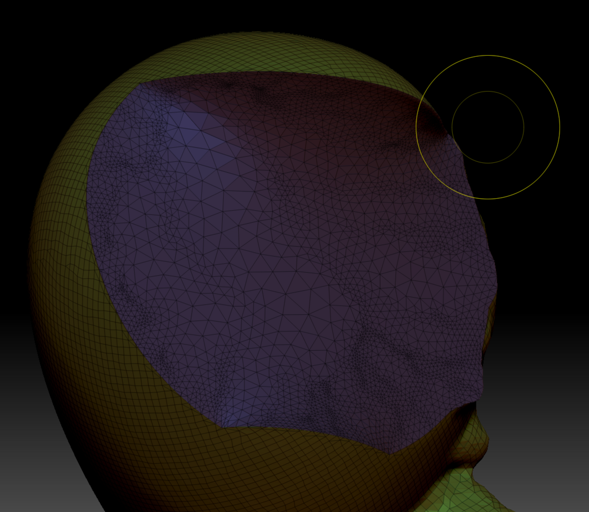
3. 交并差

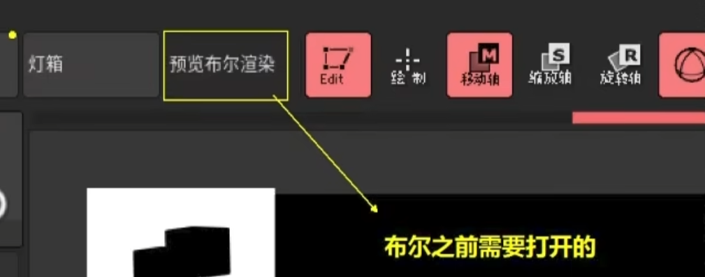
生成布尔预览。这个要打开。zb里都是预览。然后还有一个确认按钮。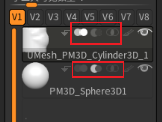
子工具里自己选择bool类型。调出合适的形状
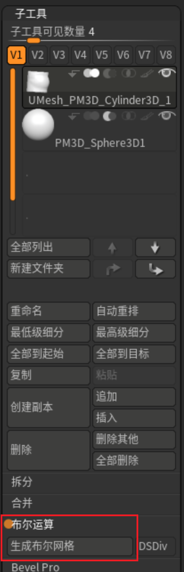
生成布尔网格。然后会创建一个新场景。在新场景里导入这个模型就可以了。

4. 结构线笔刷

5. 视角调整
6. 动态拓扑切割
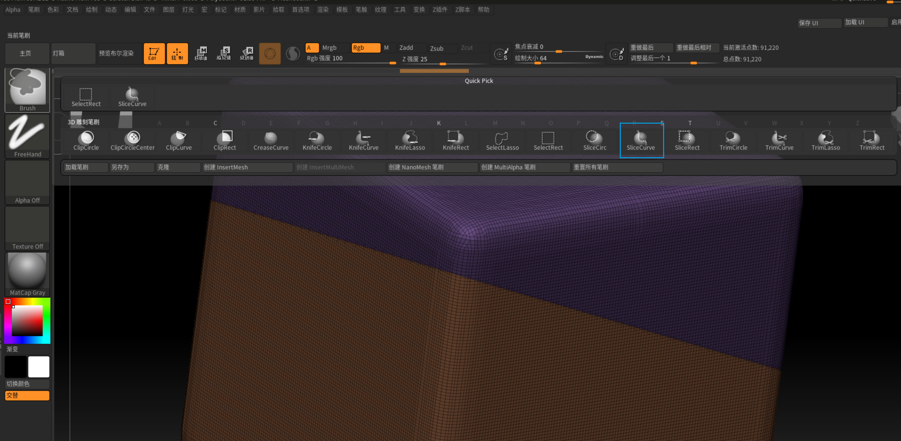 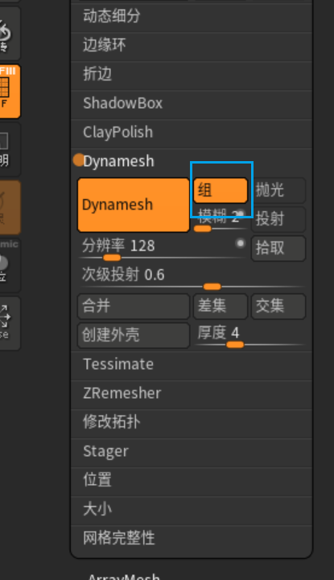 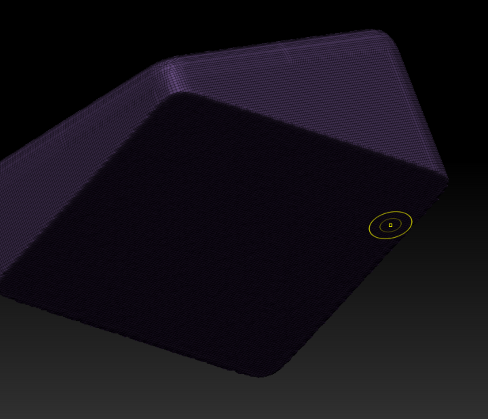 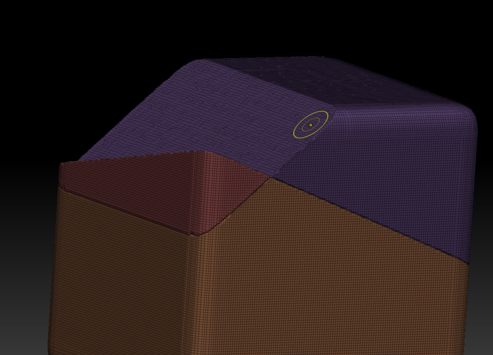 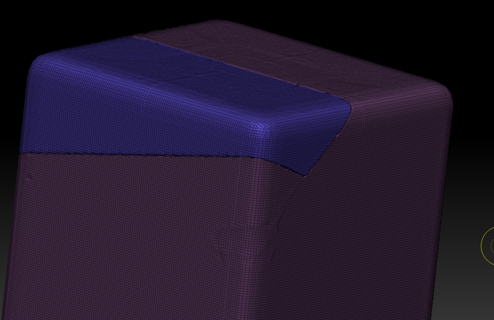 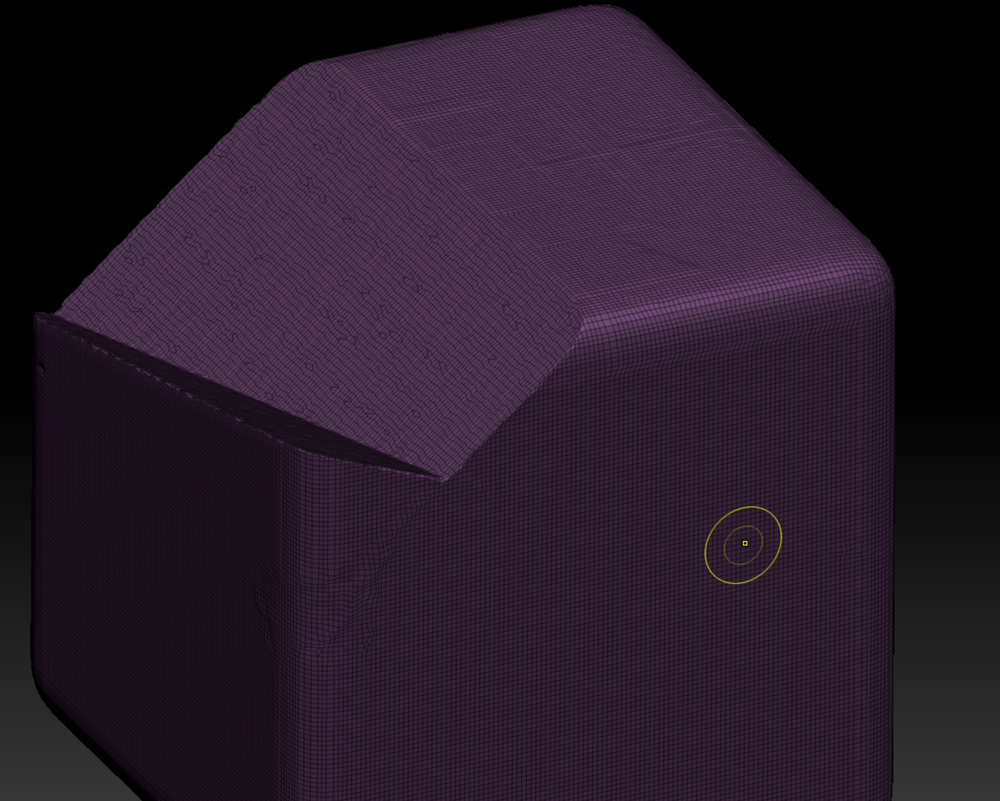