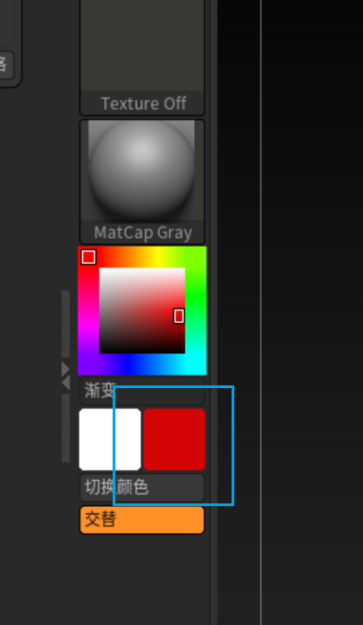
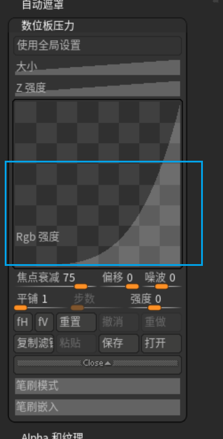
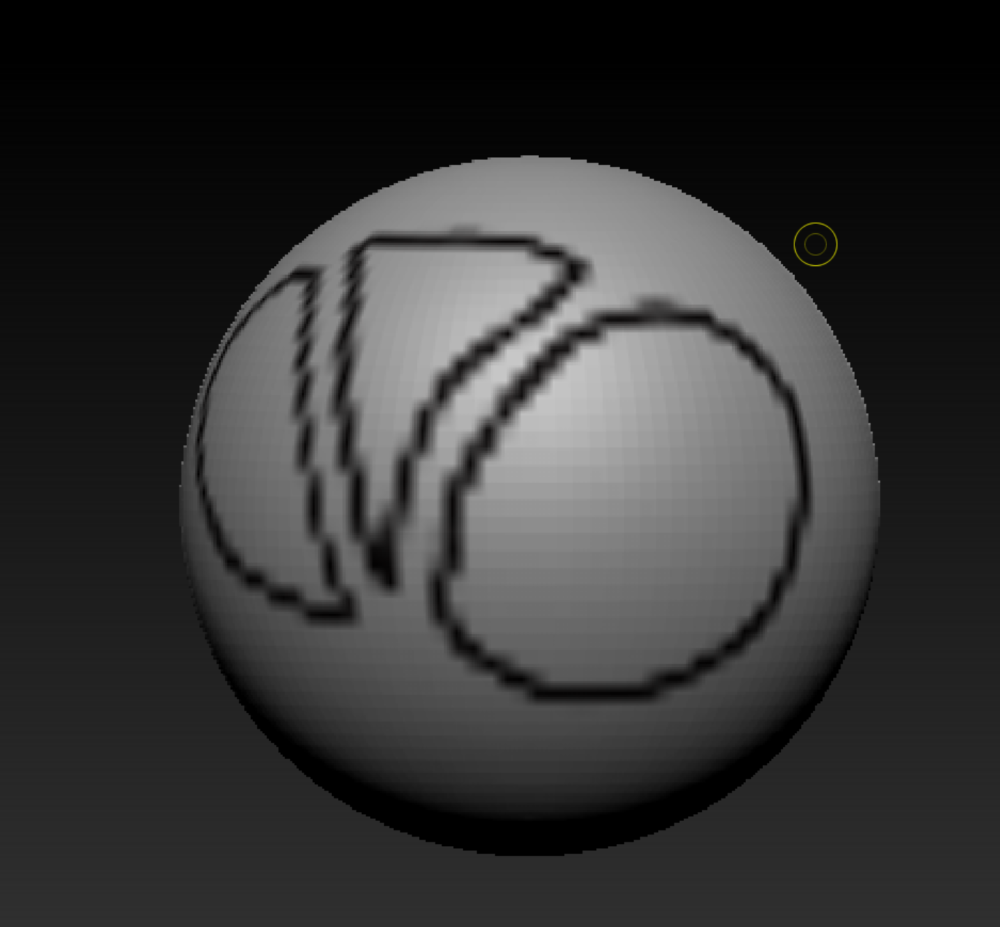
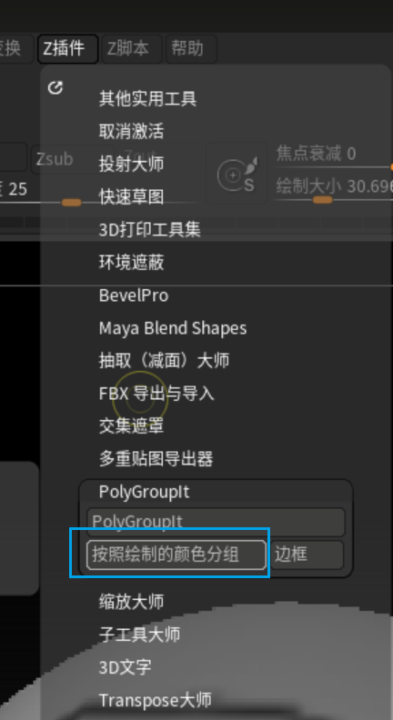
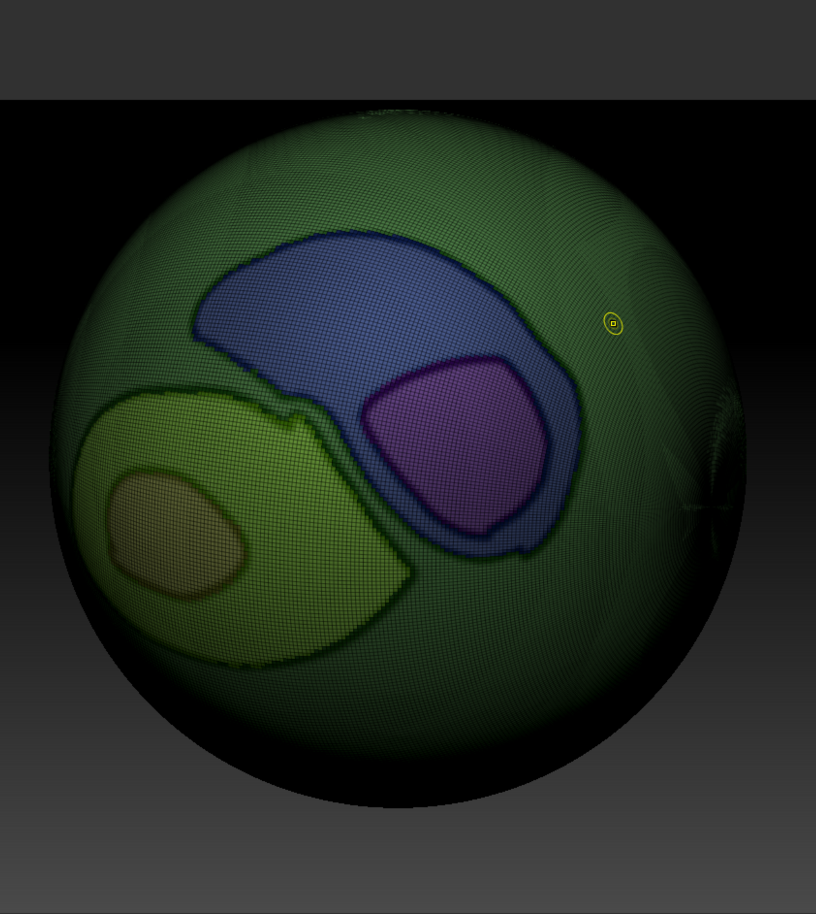
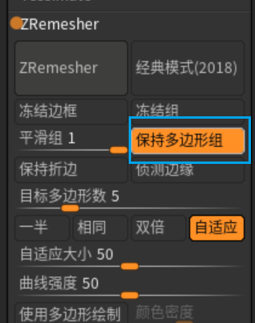
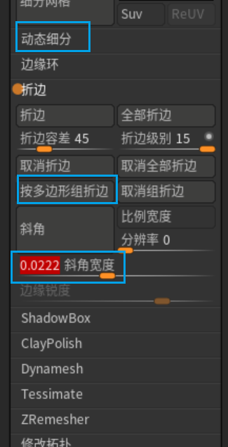
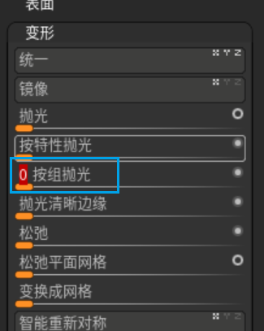
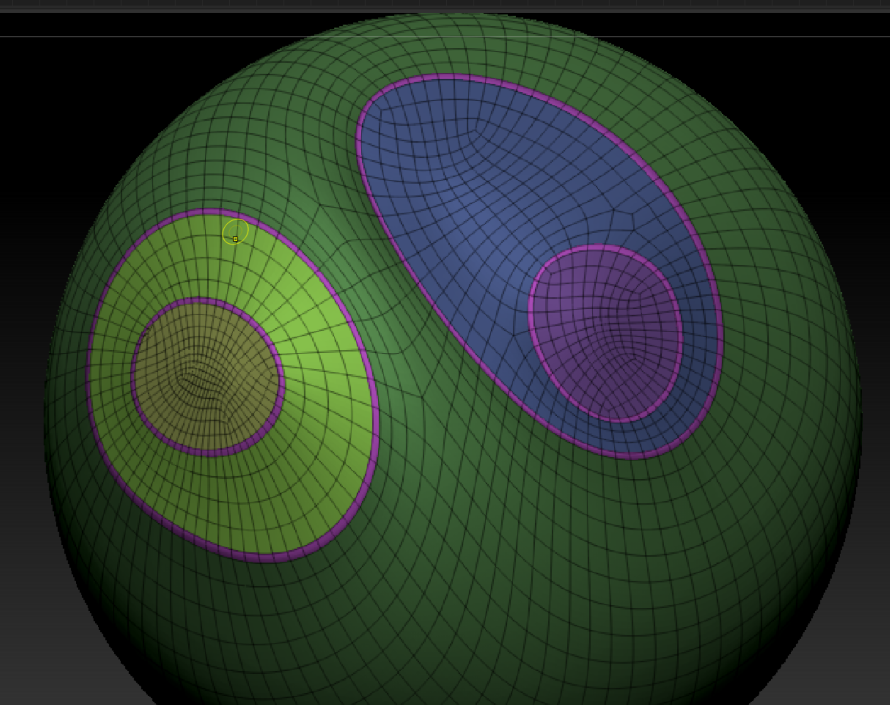

先正常雕刻

zb绘制颜色绘制不了？
右侧才是当前颜色，左侧是按下alt后的颜色

笔刷压感调节

1. 绘制出分组的边缘线，这里的面数太低了，不行的。需要高一些面熟

2. 按绘制分组

3. 分好了粗略的组

4. 重拓扑

重拓扑技巧：使用一半和一倍比较稳定！！直接指定面数很不稳定

5. 添加动态细分来预览。这个不是导出的模型效果！！这只是预览效果！！！
还有折边（也就是倒角）

6. 按组抛光

最后的效果就会非常好！

