### 0. 笔刷压感设置
首选项->数位板
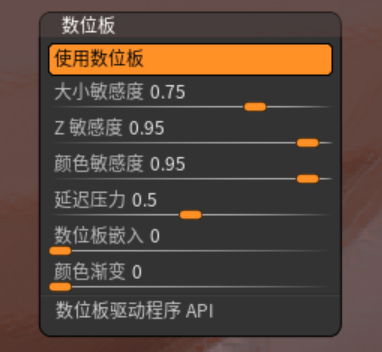
调整笔刷大小
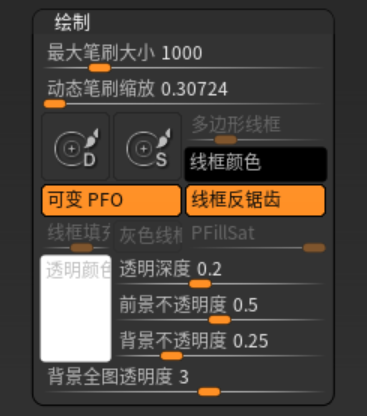
调整笔刷压感
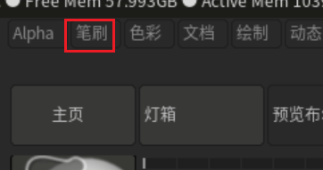
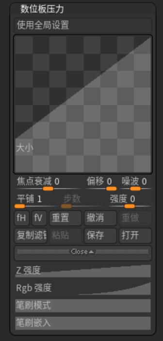
这样就可以灵活使用笔刷了。
### 1.刻线相交破面
示例笔刷:chisel(凿子)
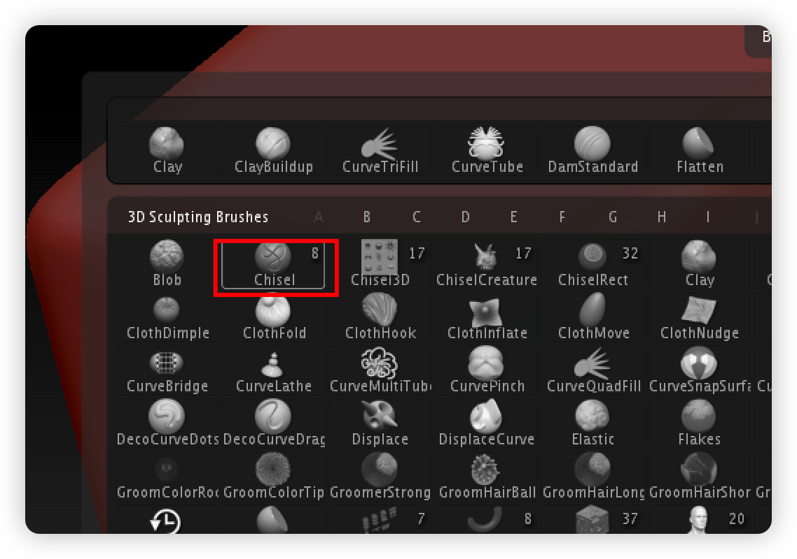
可选样式
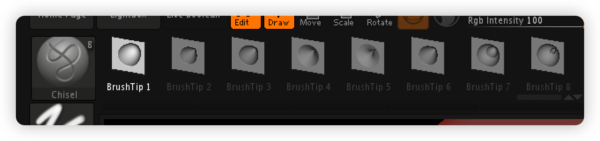
第一笔的笔划相交点没有问题
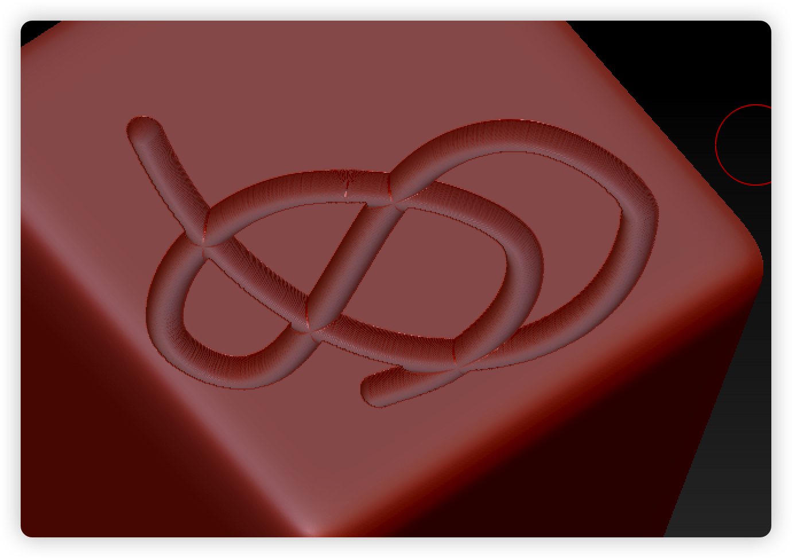
第二笔有问题了.
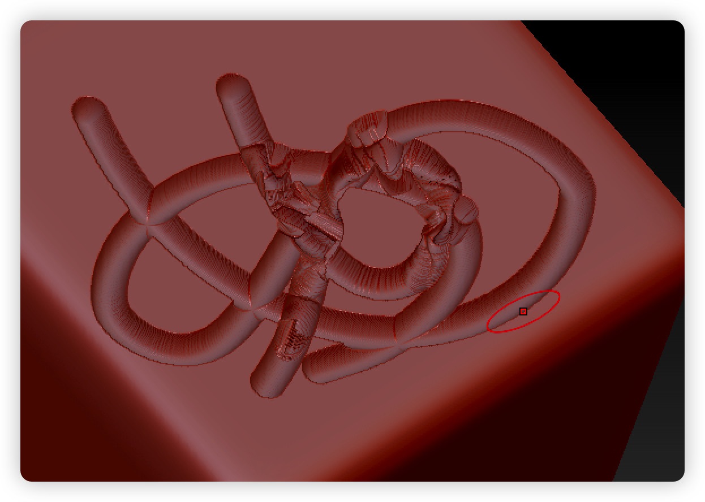
什么原因?可以理解为,笔刷画上模型是一个置换贴图.每一笔画上去了就相当于置换贴图应用给模型了.但是这种笔划我们不需要应用模型,否则下一笔画在起伏的模型表面就不是我们想要的画在平整表面的效果.
#### 储存变换目标^概念^
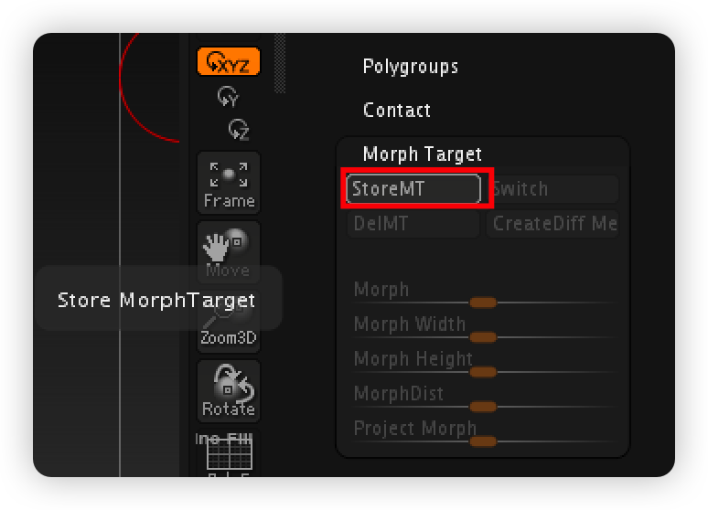
这些按钮看字面意思就能懂.
我们可以调整morph的数值来调整变换的强度信息等
甚至还有morph笔刷
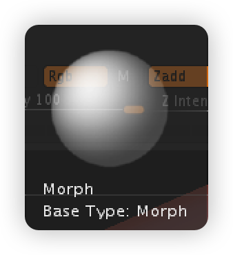
它必须在一个有变形目标的模型上才有效,很有意思的笔刷

### 2.画直线和环线
圆柱体示范
任何笔刷

**LMB > shift > 鼠标拖拽 > 松开shift > 松开LMB**
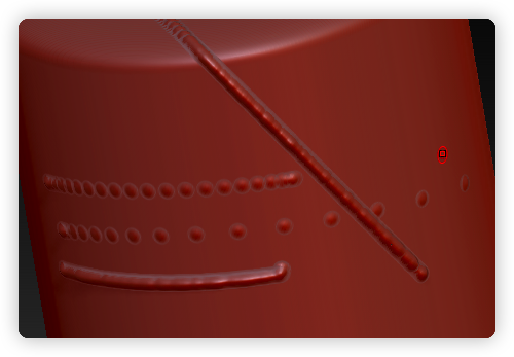

Transform菜单下的ActivateSymmetry
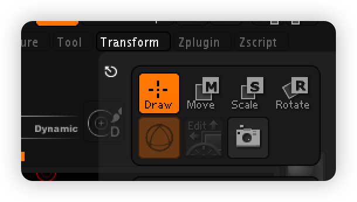
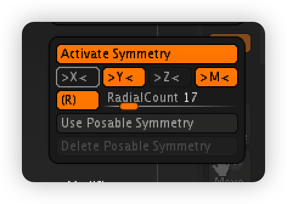

### 2.对称^技巧^
快捷键X.默认关于x轴对称.
可以在这里打开,改轴.
M和R是对称模式.是Mirror还是Radial.
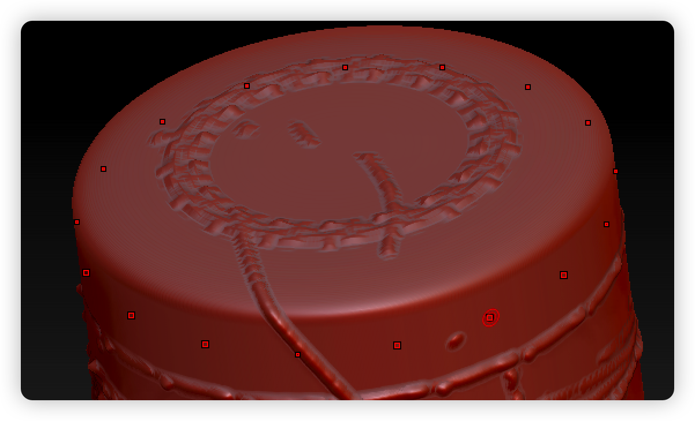
调整到正确的对称方式即可.

### 3.曲线笔刷
[曲线笔刷b站教程](https://www.bilibili.com/video/BV1HE41117cj/?vd_source=11ecd7cc3c175bd15f3113cd705e77f2)

飘带案例
通过z球创建曲线。
[z球工作流.mb](./ZSphere工作流.md)

### 4.移动笔刷move
基础功能不讲。主要是，技巧。

move默认是相对于视图平面来移动模型。

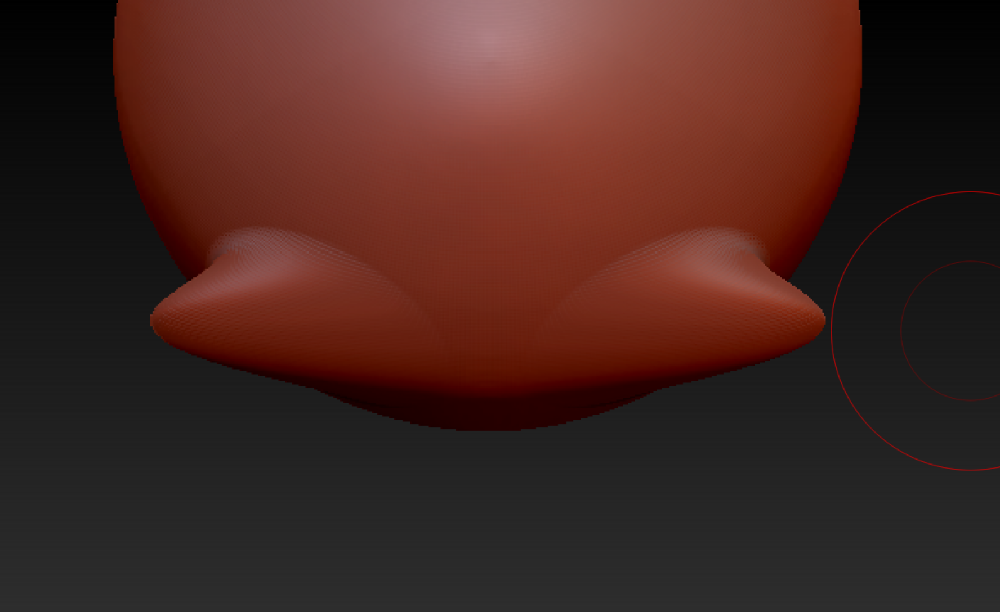

这里可以看得很清楚。是相对于视图的那个平面移动模型。

 

但是按住**shift**就会沿表面切向。

可以实现压平模型表面。
按住**alt**沿法线方向。

用来雕瞳孔很好

 

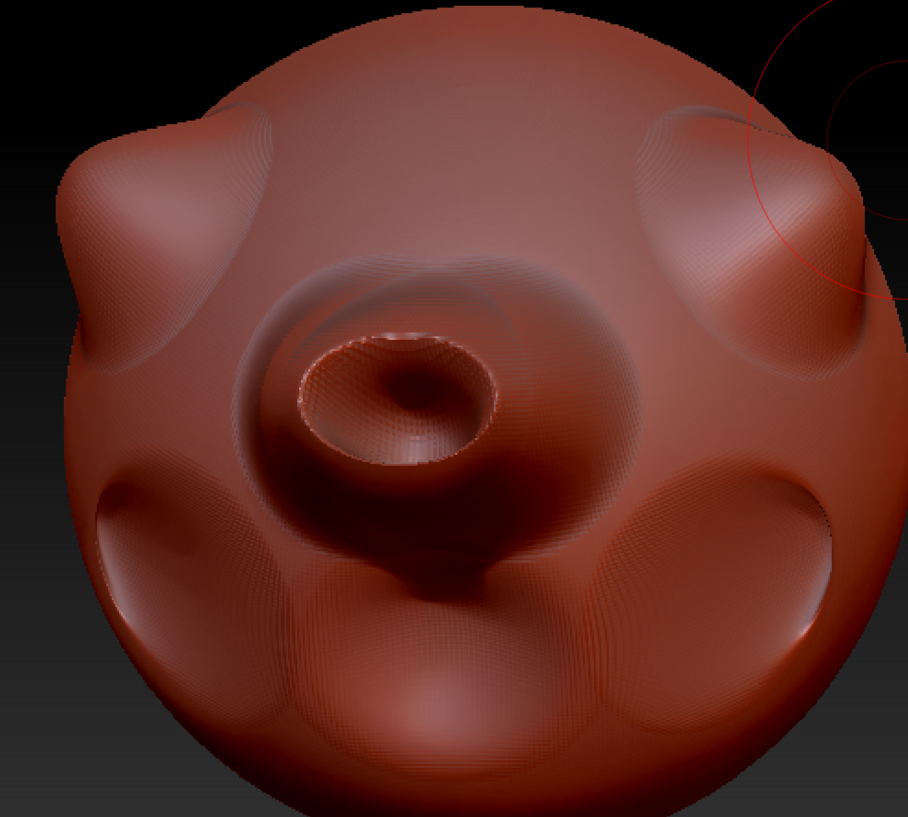

快捷键设置
按下B，呼出笔刷面板
ctrl alt LMB 选择笔刷
菜单栏出现提示
按下任意按键完成设置