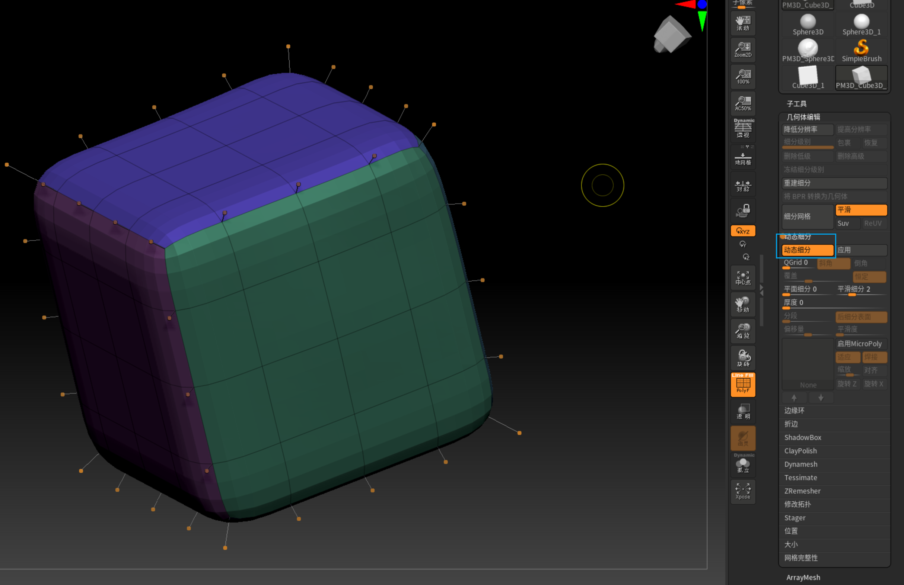

前提条件：没有真实的细分级别
[教程](https://www.bilibili.com/video/BV1wd4y1K7Hs/?spm_id_from=333.337.search-card.all.click&vd_source=11ecd7cc3c175bd15f3113cd705e77f2)
类似于maya的3平滑显示

给定一个底面数模型打开细分默认效果。很明显能理解
斜角与倒角的区别
 

平面细分与平滑细分
 

 
组抛光控件有一个小白点，它是指向内抛光和向外抛光的。效果很不一样
